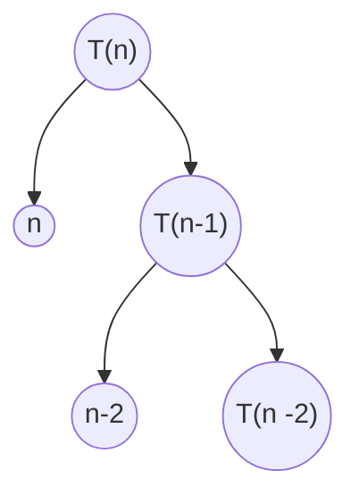

**Class**:  [[Design and Analysis of Algorithms (DAA)]]

**Title:** Recursive Functions

**Date:** 28-08-2025

**Time:** 10:07

**Tags:**

**Related:**
# Topic


---
# Keywords


--- 
# Notes

## Recurrence Relation by substitution Method

$$
T(n) =
\begin{cases}
1, & n = 0 \\
\text{...}, & n > 0
\end{cases}
$$
$$T(n) = T(n -1) +1$$
$$
T(n - 1) = ?
$$
$$
T(n - 1) = T(n - 2) +1
$$
$$
{T(n)} = {[T(n-2)+1]} + {1}
$$
$$T(n) = T(n - 2) + 2
$$
$$
T(n) = [T(n-3) +1] +2
$$

## Recurrence Relation for decreasing function

```c
void Test(int n) { 
	if(n > 0){
		for(i = 0; i < n; i++){
			printf("%d", n)
		}
		Test(n-1)
	}
}
```

**Equation of the function**
$$
T(n) = T(n-1) + 2n + 2
$$

**Substitution Method**
$$
T(n) =
\begin{cases}
1, & n = 0 \\
\text{T(n-1) + n}, & n > 0
\end{cases}
$$
$$
{T(n) = T(n-1) + n}
$$
$$
T(n-1) = T(n -2) + n - 1
$$
$$
T(n) = [T(n - 2)+ n - 1] + n
$$
$$
T(n) = T(n-3) + (n-2) + (n-1) + n
$$
**General Form**
$$
{T(n)} = {T(n - k) + (n - (k - 1)) + (n - k -2) \space... + (n - 1) +n }
$$
**Substituting 0** 
$$
T(n) = 1 + {\frac{n(n+1)}{2}}
$$
$$
\text{Therefore;}\space\space
\begin{aligned}
\text{Big O:}\space
O(n^2) \\
\text{Theta: }\Theta(n^2)
\end{aligned}
$$

**Tree Method**



---
# Work

- [ ] 

---
