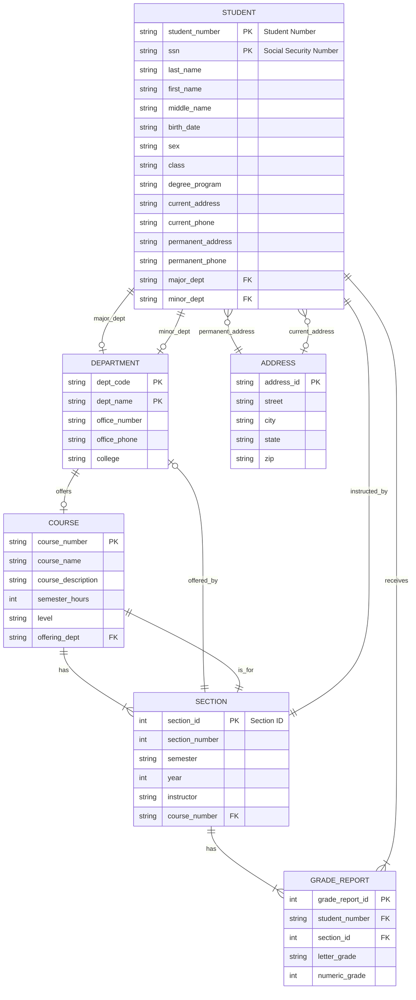

```mermaid   

erDiagram

STUDENT {

string student_number PK "Student Number"

string ssn PK "Social Security Number"

string last_name

string first_name

string middle_name

string birth_date

string sex

string class

string degree_program

string current_address

string current_phone

string permanent_address

string permanent_phone

string major_dept FK

string minor_dept FK

}

DEPARTMENT {

string dept_code PK

string dept_name PK

string office_number

string office_phone

string college

}

COURSE {

string course_number PK

string course_name

string course_description

int semester_hours

string level

string offering_dept FK

}

SECTION {

int section_id PK "Section ID"

int section_number

string semester

int year

string instructor

string course_number FK

}

GRADE_REPORT {

int grade_report_id PK

string student_number FK

int section_id FK

string letter_grade

int numeric_grade

}

  

ADDRESS {

string address_id PK

string street

string city

string state

string zip

}

  

%% Relationships and cardinality

  

STUDENT ||--o| DEPARTMENT : "major_dept"

STUDENT ||--o| DEPARTMENT : "minor_dept"

DEPARTMENT ||--o| COURSE : "offers"

COURSE ||--|{ SECTION : "has"

SECTION ||--o| DEPARTMENT : "offered_by"

SECTION ||--|| COURSE : "is_for"

SECTION ||--|| STUDENT : "instructed_by"

SECTION ||--|{ GRADE_REPORT : "has"

STUDENT ||--|{ GRADE_REPORT : "receives"

STUDENT }o--|| ADDRESS : "permanent_address"

STUDENT }o--o| ADDRESS : "current_address"
```