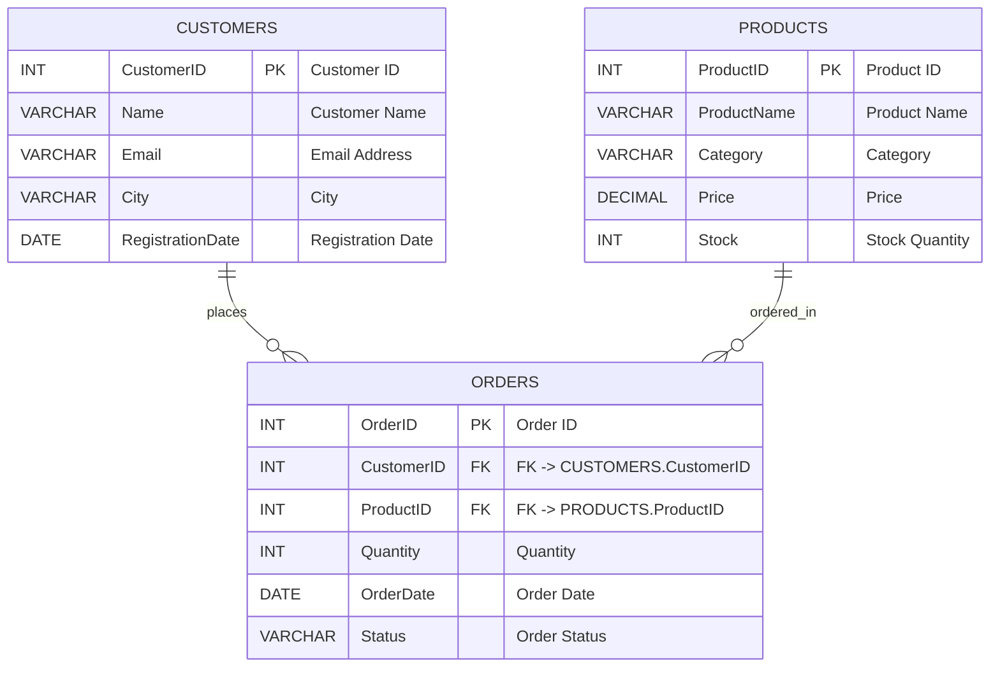

# DBMS Lab Experiment 12

## Basic Analytics on E-Commerce Dataset

---

- **Course:** DBMS Labs
- **Name:** Devesh Chandra Srivastava
- **SapID:** 590017127
- **Batch:** 66
- **Semester:** 3
- **Date:** 2025-11-17

---

## Objective

In the growing world of online shopping, companies face a major challenge: understanding customer behavior, product trends, and sales patterns from raw data. The e-commerce company in this experiment is experiencing issues such as unpredictable product demand, low visibility into customer preferences, and confusion about which categories generate the most revenue. The management wants clear insights, but all the information lies in separate tables. Your task is to act as a junior data analyst and extract meaningful conclusions by writing SQL queries. Through this exercise, you will help the company identify top-performing products, customer spending habits, high-demand categories, and ordering trends.

---

## ER Diagram



---

## ER → Relational Mapping

**Relations:**

1. CUSTOMERS (<u>CustomerID</u>, Name, Email, City, RegistrationDate)
2. PRODUCTS (<u>ProductID</u>, ProductName, Category, Price, Stock)
3. ORDERS (<u>OrderID</u>, CustomerID, ProductID, Quantity, OrderDate, Status)

_Notes: Primary keys are underlined. Foreign keys: ORDERS.CustomerID -> CUSTOMERS.CustomerID, ORDERS.ProductID -> PRODUCTS.ProductID._

---

## 1. Table Creation

### Creating CUSTOMERS Table

```sql
CREATE TABLE Customers (
    CustomerID INT PRIMARY KEY,
    Name VARCHAR(100) NOT NULL,
    Email VARCHAR(100),
    City VARCHAR(50),
    RegistrationDate DATE
);
```

### Creating PRODUCTS Table

```sql
CREATE TABLE Products (
    ProductID INT PRIMARY KEY,
    ProductName VARCHAR(100) NOT NULL,
    Category VARCHAR(50),
    Price DECIMAL(10,2),
    Stock INT
);
```

### Creating ORDERS Table

```sql
CREATE TABLE Orders (
    OrderID INT PRIMARY KEY,
    CustomerID INT,
    ProductID INT,
    Quantity INT,
    OrderDate DATE,
    Status VARCHAR(20),
    FOREIGN KEY (CustomerID) REFERENCES Customers(CustomerID),
    FOREIGN KEY (ProductID) REFERENCES Products(ProductID)
);
```

---

## 2. Inserting Sample Data

### Data for CUSTOMERS

```sql
INSERT INTO Customers (CustomerID, Name, Email, City, RegistrationDate) VALUES
(1, 'Rahul Sharma', 'rahul@example.com', 'Delhi', '2024-11-10'),
(2, 'Sneha Patel', 'sneha@example.com', 'Mumbai', '2024-10-15'),
(3, 'Arjun Reddy', 'arjun@example.com', 'Bangalore', '2024-09-12'),
(4, 'Priya Singh', 'priya@example.com', 'Delhi', '2024-08-10'),
(5, 'Aman Verma', 'aman@example.com', 'Kolkata', '2024-11-01'),
(6, 'Neha Kapoor', 'neha@example.com', 'Chennai', '2024-07-25');
```

### Data for PRODUCTS

```sql
INSERT INTO Products (ProductID, ProductName, Category, Price, Stock) VALUES
(101, 'Mobile', 'Electronics', 15000, 20),
(102, 'Laptop', 'Electronics', 55000, 10),
(103, 'Shoes', 'Fashion', 2500, 50),
(104, 'T-shirt', 'Fashion', 800, 100),
(105, 'Headphones', 'Electronics', 2200, 35),
(106, 'Backpack', 'Fashion', 1200, 40);
```

### Data for ORDERS

```sql
INSERT INTO Orders (OrderID, CustomerID, ProductID, Quantity, OrderDate, Status) VALUES
(1, 1, 101, 1, '2025-01-10', 'Delivered'),
(2, 2, 103, 2, '2025-01-12', 'Delivered'),
(3, 1, 104, 3, '2025-01-12', 'Delivered'),
(4, 3, 102, 1, '2025-01-15', 'Shipped'),
(5, 4, 101, 1, '2025-01-16', 'Delivered'),
(6, 5, 105, 2, '2025-01-18', 'Cancelled'),
(7, 2, 106, 1, '2025-01-19', 'Delivered'),
(8, 6, 103, 1, '2025-01-20', 'Delivered');
```

---

## 3. Basic Analytics

### Task 1: List all customers who are from the city 'Delhi'

**Explanation:** This query retrieves all customer records where the City column matches 'Delhi'. It helps identify the customer base in a specific geographical location.

```sql
SELECT *
FROM Customers
WHERE City = 'Delhi';
```

#### Result

|CustomerID|Name|Email|City|RegistrationDate|
|---|---|---|---|---|
|1|Rahul Sharma|rahul@example.com|Delhi|2024-11-10|
|4|Priya Singh|priya@example.com|Delhi|2024-08-10|

---

### Task 2: Display all products whose price is greater than 10,000

**Explanation:** This query filters products based on their price, showing only premium products priced above ₹10,000. This helps identify high-value inventory items.

```sql
SELECT *
FROM Products
WHERE Price > 10000;
```

#### Result

| ProductID | ProductName | Category    | Price | Stock |
| --------- | ----------- | ----------- | ----- | ----- |
| 101       | Mobile      | Electronics | 15000 | 20    |
| 102       | Laptop      | Electronics | 55000 | 10    |

---

### Task 3: Show all orders placed between '2025-01-10' and '2025-01-15'

**Explanation:** This query uses the BETWEEN operator to retrieve orders within a specific date range. This is useful for analyzing sales trends during a particular period.

```sql
SELECT *
FROM Orders
WHERE OrderDate BETWEEN '2025-01-10' AND '2025-01-15';
```

#### Result

|OrderID|CustomerID|ProductID|Quantity|OrderDate|Status|
|---|---|---|---|---|---|
|1|1|101|1|2025-01-10|Delivered|
|2|2|103|2|2025-01-12|Delivered|
|3|1|104|3|2025-01-12|Delivered|
|4|3|102|1|2025-01-15|Shipped|

---

### Task 4: Display Customer Name, Product Name, Price, Quantity for each order

**Explanation:** This query performs a JOIN operation across all three tables to combine customer information, product details, and order data. This provides a comprehensive view of each transaction.

```sql
SELECT 
    c.Name AS CustomerName,
    p.ProductName,
    p.Price,
    o.Quantity
FROM Orders o
JOIN Customers c ON o.CustomerID = c.CustomerID
JOIN Products p ON o.ProductID = p.ProductID;
```

#### Result

|CustomerName|ProductName|Price|Quantity|
|---|---|---|---|
|Rahul Sharma|Mobile|15000|1|
|Sneha Patel|Shoes|2500|2|
|Rahul Sharma|T-shirt|800|3|
|Arjun Reddy|Laptop|55000|1|
|Priya Singh|Mobile|15000|1|
|Aman Verma|Headphones|2200|2|
|Sneha Patel|Backpack|1200|1|
|Neha Kapoor|Shoes|2500|1|

---

### Task 5: Find total quantity ordered for each product

**Explanation:** This query uses GROUP BY and SUM aggregate function to calculate the total quantity ordered for each product. This helps identify product demand and inventory planning.

```sql
SELECT 
    p.ProductID,
    p.ProductName,
    SUM(o.Quantity) AS TotalQuantityOrdered
FROM Products p
LEFT JOIN Orders o ON p.ProductID = o.ProductID
GROUP BY p.ProductID, p.ProductName
ORDER BY TotalQuantityOrdered DESC;
```

#### Result

|ProductID|ProductName|TotalQuantityOrdered|
|---|---|---|
|103|Shoes|3|
|101|Mobile|2|
|104|T-shirt|3|
|105|Headphones|2|
|102|Laptop|1|
|106|Backpack|1|

---

### Task 6: Find total spending done by each customer (Quantity × Price)

**Explanation:** This query calculates the total amount spent by each customer by multiplying quantity and price for each order, then summing it up per customer. This identifies the most valuable customers.

```sql
SELECT 
    c.CustomerID,
    c.Name,
    SUM(o.Quantity * p.Price) AS TotalSpending
FROM Customers c
LEFT JOIN Orders o ON c.CustomerID = o.CustomerID
LEFT JOIN Products p ON o.ProductID = p.ProductID
GROUP BY c.CustomerID, c.Name
ORDER BY TotalSpending DESC;
```

#### Result

|CustomerID|Name|TotalSpending|
|---|---|---|
|3|Arjun Reddy|55000|
|1|Rahul Sharma|17400|
|4|Priya Singh|15000|
|2|Sneha Patel|6200|
|5|Aman Verma|4400|
|6|Neha Kapoor|2500|

---


### Task 7: Identify customers whose total spending is greater than the average spending of all customers

**Explanation:** This query uses a subquery to calculate the average spending across all customers, then filters to show only those customers who spent more than this average. This identifies high-value customers for targeted marketing.

```sql
SELECT 
    c.CustomerID,
    c.Name,
    SUM(o.Quantity * p.Price) AS TotalSpending
FROM Customers c
JOIN Orders o ON c.CustomerID = o.CustomerID
JOIN Products p ON o.ProductID = p.ProductID
GROUP BY c.CustomerID, c.Name
HAVING SUM(o.Quantity * p.Price) > (
    SELECT AVG(CustomerSpending)
    FROM (
        SELECT SUM(o2.Quantity * p2.Price) AS CustomerSpending
        FROM Orders o2
        JOIN Products p2 ON o2.ProductID = p2.ProductID
        GROUP BY o2.CustomerID
    ) AS AvgCalc
);
```

#### Result

|CustomerID|Name|TotalSpending|
|---|---|---|
|3|Arjun Reddy|55000|
|1|Rahul Sharma|17400|

---

### Task 8: List product categories where the total quantity ordered is more than 3

**Explanation:** This query groups orders by product category and calculates the total quantity ordered per category. Only categories with total quantity greater than 3 are displayed. This helps identify popular product categories.

```sql
SELECT 
    p.Category,
    SUM(o.Quantity) AS TotalQuantity
FROM Products p
JOIN Orders o ON p.ProductID = o.ProductID
GROUP BY p.Category
HAVING SUM(o.Quantity) > 3;
```

#### Result

|Category|TotalQuantity|
|---|---|
|Fashion|7|
|Electronics|4|

---

### Task 9: Find the date on which the maximum number of orders were placed

**Explanation:** This query groups orders by date and counts the number of orders per day. It then orders the results in descending order and limits to the top result to find the busiest day. This helps identify peak ordering periods.

```sql
SELECT 
    OrderDate,
    COUNT(*) AS NumberOfOrders
FROM Orders
GROUP BY OrderDate
ORDER BY NumberOfOrders DESC
LIMIT 1;
```

#### Result

|OrderDate|NumberOfOrders|
|---|---|
|2025-01-12|2|

---

### Task 10: Find the product that generated the highest total revenue (Price × Quantity)

**Explanation:** This query calculates the total revenue generated by each product by multiplying price and quantity for all orders of that product. It then orders by revenue in descending order to find the top revenue-generating product. This identifies the most profitable products.

```sql
SELECT 
    p.ProductID,
    p.ProductName,
    p.Category,
    SUM(o.Quantity * p.Price) AS TotalRevenue
FROM Products p
JOIN Orders o ON p.ProductID = o.ProductID
GROUP BY p.ProductID, p.ProductName, p.Category
ORDER BY TotalRevenue DESC
LIMIT 1;
```

#### Result

|ProductID|ProductName|Category|TotalRevenue|
|---|---|---|---|
|102|Laptop|Electronics|55000|

---

## 5. Additional Operations (Optional)

### Update: Modify product price

```sql
UPDATE Products 
SET Price = 16000 
WHERE ProductID = 101;
```

### Delete: Remove cancelled orders

```sql
DELETE FROM Orders 
WHERE Status = 'Cancelled';
```

### Alter: Add discount column to PRODUCTS

```sql
ALTER TABLE Products 
ADD COLUMN Discount DECIMAL(5,2) DEFAULT 0.00;
```

---

## Conclusion

This lab experiment successfully demonstrates the application of SQL queries for e-commerce analytics. Through various SELECT, JOIN, GROUP BY, and aggregate functions, we extracted meaningful insights about customer behavior, product performance, and sales patterns. The queries ranged from basic data retrieval to complex analytical operations involving subqueries and multiple table joins. These skills are essential for data-driven decision-making in modern e-commerce businesses.

---