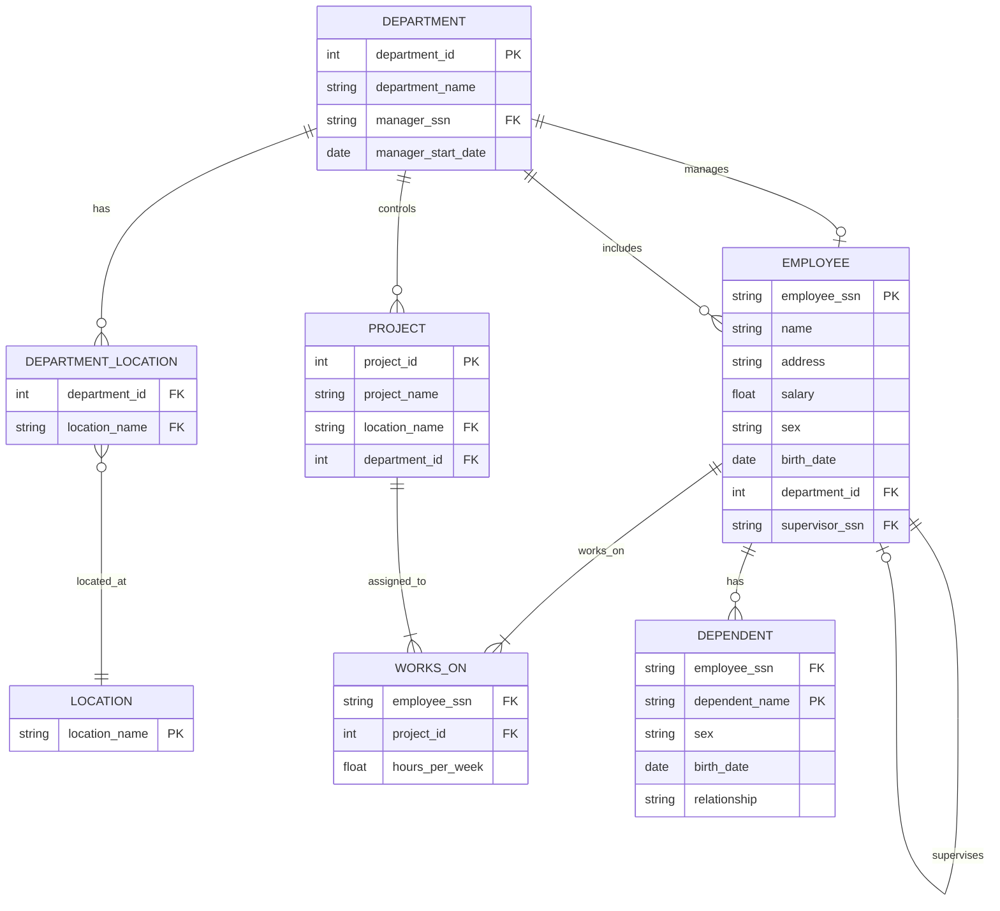

### Experiment 2: Consider the following set of requirements for a Company database that is used to keep track of employee

The company is organised into departments. Each department has a unique name, a unique number, and a particular employee who manages the department. We keep track of the start date when that employee began managing the department. A department may have several locations.

- A department controls a number of projects, each of which has a unique name, a unique number, and a single location

- We store each employee’s name, Social Security number,2 address, salary, sex (gender), and birth date. An employee is assigned to one department, but may work on several projects, which are not necessarily controlled by the same department. We keep track of the current number of hours per week that an employee works on each project. We also keep track of the direct supervisor of each employee (who is another employee).
- We want to keep track of the dependants  of each employee for insurance purposes. We keep each dependent’s first name, sex, birth date, and relationship to the employee
##### Key  for Relationship and Cardinality
- `||--o|` One-to-one (or one-to-many, with one side mandatory and the other optional)
- `||--|{` One-to-many (mandatory one to many)
- `|o--o{` Zero-or-one to many (optional)
- `o|--o{` Optional one-to-many

