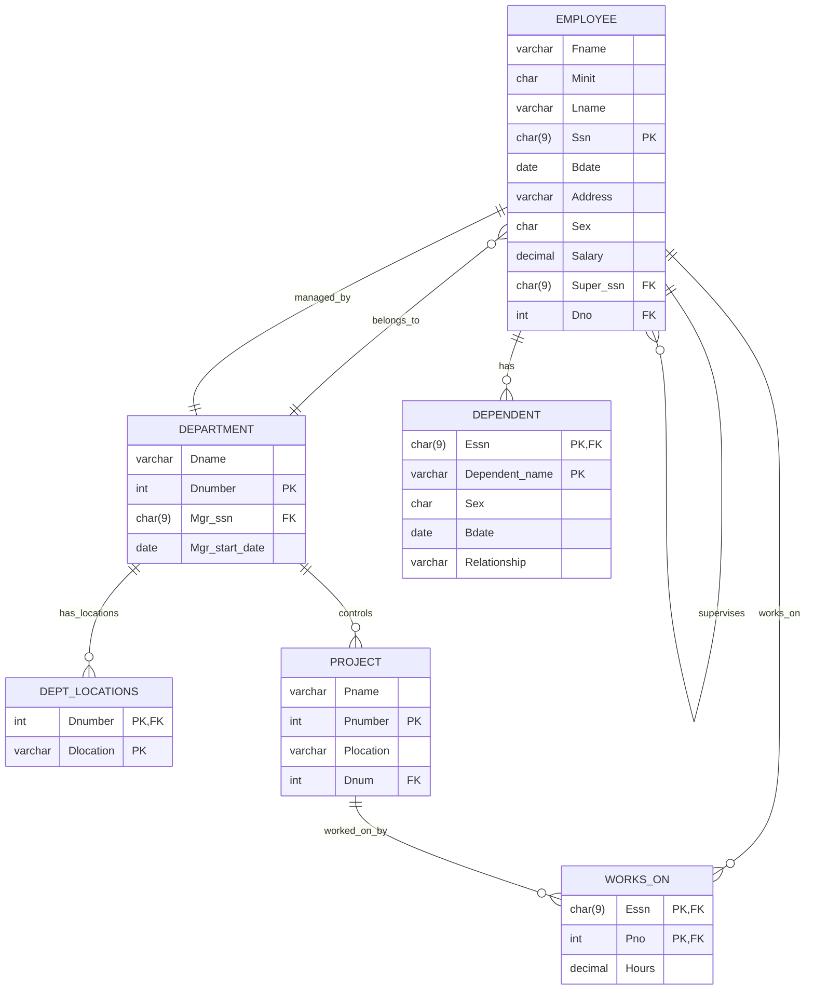

# DBMS Lab Experiment 06
## Use of Inbuilt Functions and Relational Algebra Operations
---
- **Course:**[[DBMS]]
- **Name:**  Devesh Chandra Srivastava
- **SapID:** 590017127
- **Batch:** 66
- **Semester:** 3 rd
- **Date:** 2025-09-08

---

## Objective
To understand the use of inbuilt functions and relational algebra with SQL queries by implementing various operations on the COMPANY database schema.

---

## Schema Reference

### Database Relations and Attributes



---

## Query Solutions

### Q 1. Retrieve the first name, last name, and salary of all employees.

**Problem Statement:** Retrieve the first name, last name, and salary of all employees.

**Relational Algebra:**
$$\pi_{Fname, Lname, Salary}(EMPLOYEE)$$

**SQL Query:**
```sql
SELECT Fname, Lname, Salary
FROM EMPLOYEE
ORDER BY Salary DESC;
```

**Result Evidence:**
![[Pasted image 20250908151348.png]]


**Explanation:** This query projects the first name, last name, and salary columns from the EMPLOYEE relation, returning all employee records with these three attributes.

---

### Q 2. Retrieve the names of all projects located in Houston.

**Problem Statement:** Retrieve the names of all projects located in Houston.

**Relational Algebra:**
$$\pi_{Pname}(\sigma_{Plocation='Houston'}(PROJECT))$$

**SQL Query:**
```sql
SELECT Pname
FROM PROJECT
WHERE UPPER(Plocation) = UPPER('Houston');
```

**Result Evidence:**


**Explanation:** This query selects projects where the location matches 'Houston', using UPPER () function for case-insensitive comparison.

---

### Q 3. List the names and birth dates of employees whose salary is greater than 50,000.

**Problem Statement:** List the names and birth dates of employees whose salary is greater than 50,000.

**Relational Algebra:**
$$\pi_{Fname, Minit, Lname, Bdate}(\sigma_{Salary > 50000}(EMPLOYEE))$$

**SQL Query:**
```sql
SELECT Fname, Minit, Lname, Bdate
FROM EMPLOYEE
WHERE Salary > 50000;
```

**Result Evidence:**


**Explanation:** This query filters employees with salary greater than 50,000 and projects their names and birth dates.

---

### Q 4. Retrieve the names of all employees in department 5 who work more than 10 hours per week on the 'ProductX' project.

**Problem Statement:** Retrieve the names of all employees in department 5 who work more than 10 hours per week on the 'ProductX' project.

**Relational Algebra:**
$$\pi_{Fname, Minit, Lname}(\sigma_{Dno=5}(EMPLOYEE) \bowtie_{Ssn=Essn} \sigma_{Hours>10}(WORKS\_ON) \bowtie_{Pno=Pnumber} \sigma_{Pname='ProductX'}(PROJECT))$$

**SQL Query:**
```sql
SELECT DISTINCT e.Fname, e.Minit, e.Lname
FROM EMPLOYEE e
JOIN WORKS_ON w ON w.Essn = e.Ssn
JOIN PROJECT p ON p.Pnumber = w.Pno
WHERE e.Dno = 5
  AND UPPER(p.Pname) = UPPER('ProductX')
  AND w.Hours > 10;
```

**Result Evidence:**


**Explanation:** This query joins three relations to find employees in department 5 working more than 10 hours on ProductX project.

---

### Q 5. List the names of all employees who have a dependent with the same first name as themselves.

**Problem Statement:** List the names of all employees who have a dependent with the same first name as themselves.

**Relational Algebra:**
$$\pi_{Fname, Minit, Lname}(EMPLOYEE \bowtie_{Ssn=Essn \land Fname=Dependent\_name} DEPENDENT)$$

**SQL Query:**
```sql
SELECT DISTINCT e.Fname, e.Minit, e.Lname
FROM EMPLOYEE e
JOIN DEPENDENT d ON e.Ssn = d.Essn
WHERE UPPER(e.Fname) = UPPER(d.Dependent_name);
```

**Result Evidence:**


**Explanation:** This query finds employees whose first name matches any of their dependents' names using case-insensitive comparison.

---

### Q 6. Find the names of employees who are directly supervised by 'Franklin Wong'.

**Problem Statement:** Find the names of employees who are directly supervised by 'Franklin Wong'.

**Relational Algebra:**
$$\pi_{E2.Fname, E2.Minit, E2.Lname}(\rho_{E1}(\sigma_{Fname='Franklin' \land Lname='Wong'}(EMPLOYEE)) \bowtie_{E1.Ssn=E2.Super\_ssn} \rho_{E2}(EMPLOYEE))$$

**SQL Query:**
```sql
SELECT e2.Fname, e2.Minit, e2.Lname
FROM EMPLOYEE e1
JOIN EMPLOYEE e2 ON e1.Ssn = e2.Super_ssn
WHERE UPPER(e1.Fname) = UPPER('Franklin')
  AND UPPER(e1.Lname) = UPPER('Wong');
```

**Result Evidence:**


**Explanation:** This self-join query finds all employees supervised by Franklin Wong by matching supervisor SSN.

---

### Q 7. Retrieve the names of employees who work on every project.

**Problem Statement:** Retrieve the names of employees who work on every project.

**Relational Algebra:**
$$\pi_{Fname, Minit, Lname}((\pi_{Essn}(WORKS\_ON) \div \pi_{Pnumber}(PROJECT)) \bowtie_{Essn=Ssn} EMPLOYEE)$$

**SQL Query:**
```sql
SELECT e.Fname, e.Minit, e.Lname
FROM EMPLOYEE e
WHERE NOT EXISTS (
    SELECT p.Pnumber
    FROM PROJECT p
    WHERE NOT EXISTS (
        SELECT w.Pno
        FROM WORKS_ON w
        WHERE w.Essn = e.Ssn AND w.Pno = p.Pnumber
    )
);
```

**Result Evidence:**

**Explanation:** This query uses division operation (implemented with double NOT EXISTS) to find employees working on all projects.

---

### Q 8. Retrieve the names of employees who do not work on any project.

**Problem Statement:** Retrieve the names of employees who do not work on any project.

**Relational Algebra:**
$$\pi_{Fname, Minit, Lname}(EMPLOYEE - \pi_{Ssn}(EMPLOYEE \bowtie_{Ssn=Essn} WORKS\_ON))$$

**SQL Query:**
```sql
SELECT e.Fname, e.Minit, e.Lname
FROM EMPLOYEE e
WHERE e.Ssn NOT IN (
    SELECT DISTINCT w.Essn
    FROM WORKS_ON w
    WHERE w.Essn IS NOT NULL
);
```

**Result Evidence:**


**Explanation:** This query finds employees whose SSN does not appear in the WORKS_ON relation.

---

### Q 9. Retrieve the names and addresses of all employees who work on at least one project located in Houston but whose department has no location in Houston.

**Problem Statement:** Retrieve the names and addresses of all employees who work on at least one project located in Houston but whose department has no location in Houston.

**Relational Algebra:**
$$\pi_{Fname, Minit, Lname, Address}((EMPLOYEE \bowtie_{Ssn=Essn} WORKS\_ON \bowtie_{Pno=Pnumber} \sigma_{Plocation='Houston'}(PROJECT)) - (EMPLOYEE \bowtie_{Dno=Dnumber} \sigma_{Dlocation='Houston'}(DEPT\_LOCATIONS)))$$

**SQL Query:**
```sql
SELECT DISTINCT e.Fname, e.Minit, e.Lname, e.Address
FROM EMPLOYEE e
JOIN WORKS_ON w ON e.Ssn = w.Essn
JOIN PROJECT p ON w.Pno = p.Pnumber
WHERE UPPER (p.Plocation) = UPPER ('Houston')
  AND e.Dno NOT IN (
    SELECT dl. Dnumber
    FROM DEPT_LOCATIONS dl
    WHERE UPPER (dl. Dlocation) = UPPER ('Houston')
  );
```

**Result Evidence:**


**Explanation:** This query finds employees working on Houston projects whose departments don't have Houston locations.

---

### Q 10. Retrieve the last names of all department managers who have no dependents.

**Problem Statement:** Retrieve the last names of all department managers who have no dependents.

**Relational Algebra:**
$$\pi_{Lname}((\pi_{Mgr\_ssn}(DEPARTMENT) \bowtie_{Mgr\_ssn=Ssn} EMPLOYEE) - \pi_{Ssn}(EMPLOYEE \bowtie_{Ssn=Essn} DEPENDENT))$$

**SQL Query:**
```sql
SELECT DISTINCT e.Lname
FROM EMPLOYEE e
JOIN DEPARTMENT d ON e.Ssn = d.Mgr_ssn
WHERE e.Ssn NOT IN (
    SELECT DISTINCT dep. Essn
    FROM DEPENDENT dep
    WHERE dep. Essn IS NOT NULL
);
```

**Result Evidence:**


**Explanation:** This query finds department managers who don't appear in the DEPENDENT relation as having any dependents.

---
