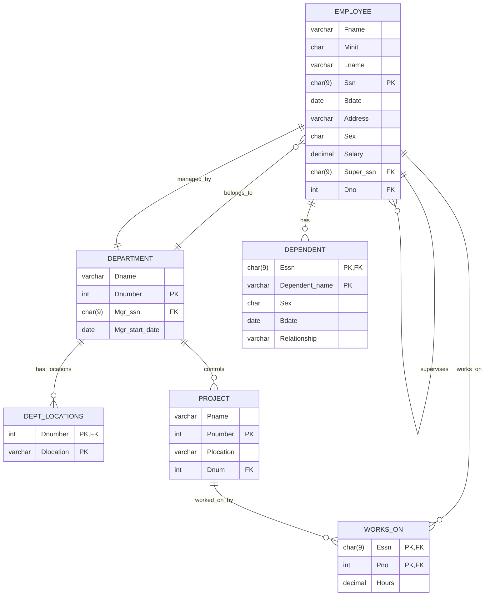

# DBMS Lab Experiment 06
## Use of Inbuilt Functions and Relational Algebra Operations
---
- **Course:** [[DBMS]]
- **Name:** Devesh Chandra Srivastava
- **SapID:** 590017127
- **Batch:** 66
- **Semester:** 3
- **Date:** 2025-09-08

---

## Schema Reference

### Database Relations and Attributes



---

## Query Solutions

### Q 1. Retrieve the first name, last name, and salary of all employees.

**Problem Statement:** Retrieve the first name, last name, and salary of all employees.

**Relational Algebra:**
$$\pi_{Fname, Lname, Salary}(EMPLOYEE)$$

**SQL Query:**
```sql
SELECT fname, lname, salary
FROM employee
ORDER BY salary DESC;
```

**Result Evidence:**
![[Pasted image 20250908153632.png]]

**Explanation:** This query projects the first name, last name, and salary columns from the EMPLOYEE relation, returning all Indian employee records with these three attributes.

---

### Q 2. Retrieve the names of all projects located in Mumbai.

**Problem Statement:** Retrieve the names of all projects located in Mumbai.

**Relational Algebra:**
$$\pi_{Pname}(\sigma_{Plocation='Mumbai'}(PROJECT))$$

**SQL Query:**
```sql
SELECT pname
FROM project
WHERE UPPER(plocation) = UPPER('Mumbai');
```

**Result Evidence:**
![[Pasted image 20250908153830.png]]

**Explanation:** This query selects projects where the location matches 'Mumbai', using UPPER () function for case-insensitive comparison.

---

### Q 3. List the names and birth dates of employees whose salary is greater than 100,000.

**Problem Statement:** List the names and birth dates of employees whose salary is greater than 1,00,000 (1 Lakh).

**Relational Algebra:**
$$\pi_{Fname, Minit, Lname, Bdate}(\sigma_{Salary > 100000}(EMPLOYEE))$$

**SQL Query:**
```sql
SELECT fname, minit, lname, bdate, salary
FROM employee
WHERE salary > 100000
ORDER BY salary DESC;
```

**Result Evidence:**
![[Pasted image 20250908153856.png]]


**Explanation:** This query filters employees with salary greater than 1,00,000 and projects their names and birth dates.

---

### Q 4. Retrieve the names of all employees in department 5 who work more than 10 hours per week on the 'DigitalIndia' project.

**Problem Statement:** Retrieve the names of all employees in department 5 who work more than 10 hours per week on the 'DigitalIndia' project.

**Relational Algebra:**
$$\pi_{Fname, Minit, Lname}(\sigma_{Dno=5}(EMPLOYEE) \bowtie_{Ssn=Essn} \sigma_{Hours>10}(WORKS\_ON) \bowtie_{Pno=Pnumber} \sigma_{Pname='DigitalIndia'}(PROJECT))$$

**SQL Query:**
```sql
SELECT DISTINCT e.fname, e.minit, e.lname, w.hours
FROM employee e
INNER JOIN works_on w ON w.essn = e.ssn
INNER JOIN project p ON p.pnumber = w.pno
WHERE e.dno = 5
  AND UPPER(p.pname) = UPPER('DigitalIndia')
  AND w.hours > 10;
```

**Result Evidence:**


**Explanation:** This query joins three relations to find employees in department 5 working more than 10 hours on DigitalIndia project.

---

### Q 5. List the names of all employees who have a dependent with the same first name as themselves.

**Problem Statement:** List the names of all employees who have a dependent with the same first name as themselves.

**Relational Algebra:**
$$\pi_{Fname, Minit, Lname}(EMPLOYEE \bowtie_{Ssn=Essn \land Fname=Dependent\_name} DEPENDENT)$$

**SQL Query:**
```sql
SELECT DISTINCT e.fname, e.minit, e.lname, d.dependent_name
FROM employee e
INNER JOIN dependent d ON e.ssn = d.essn
WHERE UPPER(e.fname) = UPPER(d.dependent_name);
```

**Result Evidence:**


**Explanation:** This query finds employees whose first name matches any of their dependents' names using case-insensitive comparison.

---

### Q 6. Find the names of employees who are directly supervised by 'Priya Patel'.

**Problem Statement:** Find the names of employees who are directly supervised by 'Priya Patel'.

**Relational Algebra:**
$$\pi_{E2.Fname, E2.Minit, E2.Lname}(\rho_{E1}(\sigma_{Fname='Priya' \land Lname='Patel'}(EMPLOYEE)) \bowtie_{E1.Ssn=E2.Super\_ssn} \rho_{E2}(EMPLOYEE))$$

**SQL Query:**
```sql
SELECT e2.fname, e2.minit, e2.lname,
       CONCAT(e1.fname, ' ', e1.lname) AS supervisor
FROM employee e1
INNER JOIN employee e2 ON e1.ssn = e2.super_ssn
WHERE UPPER(e1.fname) = UPPER('Priya')
  AND UPPER(e1.lname) = UPPER('Patel');
```

**Result Evidence:**


**Explanation:** This self-join query finds all employees supervised by Priya Patel by matching supervisor SSN.

---

### Q 7. Retrieve the names of employees who work on every project.

**Problem Statement:** Retrieve the names of employees who work on every project.

**Relational Algebra:**
$$\pi_{Fname, Minit, Lname}((\pi_{Essn}(WORKS\_ON) \div \pi_{Pnumber}(PROJECT)) \bowtie_{Essn=Ssn} EMPLOYEE)$$

**SQL Query:**
```sql
SELECT e.fname, e.minit, e.lname
FROM employee e
WHERE NOT EXISTS (
    SELECT p.pnumber
    FROM project p
    WHERE NOT EXISTS (
        SELECT w.pno
        FROM works_on w
        WHERE w.essn = e.ssn AND w.pno = p.pnumber
    )
);
```

**Result Evidence:**


**Explanation:** This query uses division operation (implemented with double NOT EXISTS) to find employees working on all projects.

---

### Q 8. Retrieve the names of employees who do not work on any project.

**Problem Statement:** Retrieve the names of employees who do not work on any project.

**Relational Algebra:**
$$\pi_{Fname, Minit, Lname}(EMPLOYEE - \pi_{Ssn}(EMPLOYEE \bowtie_{Ssn=Essn} WORKS\_ON))$$

**SQL Query:**
```sql
SELECT e.fname, e.minit, e.lname
FROM employee e
WHERE e.ssn NOT IN (
    SELECT DISTINCT w.essn
    FROM works_on w
    WHERE w.essn IS NOT NULL
);
```

**Result Evidence:**


**Explanation:** This query finds employees whose SSN does not appear in the WORKS_ON relation.

---

### Q 9. Retrieve the names and addresses of all employees who work on at least one project located in Mumbai but whose department has no location in Mumbai.

**Problem Statement:** Retrieve the names and addresses of all employees who work on at least one project located in Mumbai but whose department has no location in Mumbai.

**Relational Algebra:**
$$\pi_{Fname, Minit, Lname, Address}((EMPLOYEE \bowtie_{Ssn=Essn} WORKS\_ON \bowtie_{Pno=Pnumber} \sigma_{Plocation='Mumbai'}(PROJECT)) - (EMPLOYEE \bowtie_{Dno=Dnumber} \sigma_{Dlocation='Mumbai'}(DEPT\_LOCATIONS)))$$

**SQL Query:**
```sql
SELECT DISTINCT e.fname, e.minit, e.lname, e.address
FROM employee e
INNER JOIN works_on w ON e.ssn = w.essn
INNER JOIN project p ON w.pno = p.pnumber
WHERE UPPER(p.plocation) = UPPER('Mumbai')
  AND e.dno NOT IN (
    SELECT dl.dnumber
    FROM dept_locations dl
    WHERE UPPER(dl.dlocation) = UPPER('Mumbai')
  );
```

**Result Evidence:**


**Explanation:** This query finds employees working on Mumbai projects whose departments don't have Mumbai locations.

---

### Q 10. Retrieve the last names of all department managers who have no dependents.

**Problem Statement:** Retrieve the last names of all department managers who have no dependents.

**Relational Algebra:**
$$\pi_{Lname}((\pi_{Mgr\_ssn}(DEPARTMENT) \bowtie_{Mgr\_ssn=Ssn} EMPLOYEE) - \pi_{Ssn}(EMPLOYEE \bowtie_{Ssn=Essn} DEPENDENT))$$

**SQL Query:**
```sql
SELECT DISTINCT e.fname, e.lname, d.dname
FROM employee e
INNER JOIN department d ON e.ssn = d.mgr_ssn
WHERE e.ssn NOT IN (
    SELECT DISTINCT dep.essn
    FROM dependent dep
    WHERE dep.essn IS NOT NULL
);
```

**Result Evidence:**


**Explanation:** This query finds department managers who don't appear in the DEPENDENT relation as having any dependents.

---
