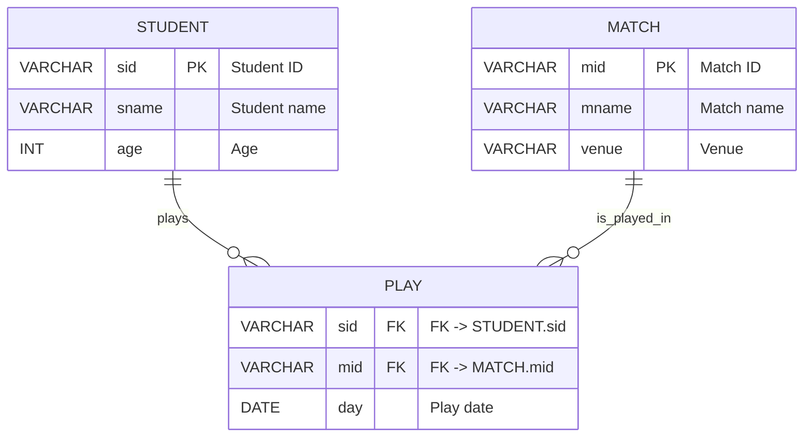

 # DBMS Lab Experiment 03
## Use of different SQL clauses and JOIN
---
- **Course:** DBMS
- **Name:** Devesh Chandra Srivastava
- **SapID:** 590017127
- **Batch:** 66
- **Semester:** 3
- **Date:** 2025-10-06
---

## ER Diagram



---

## ER → Relational Mapping

**Relations:**

1. STUDENT (<u>sid</u>, sname, age)  
2. MATCH (<u>mid</u>, mname, venue)  
3. PLAY (<u>sid, mid, day</u>)

*Notes: Primary keys are underlined. Foreign keys: PLAY. Sid -> STUDENT. Sid, PLAY. Mid -> MATCH. Mid.*

---

## 1. Table Creation

### Creating STUDENT Table
```sql
CREATE TABLE STUDENT (
    sid VARCHAR(10) PRIMARY KEY,
    sname VARCHAR(50) NOT NULL,
    age INT
);
```

### Creating MATCH Table
(If your RDBMS treats MATCH as reserved, rename to MATCHES or quote it.)
```sql
CREATE TABLE "MATCH" (
    mid VARCHAR(10) PRIMARY KEY,
    mname VARCHAR(100) NOT NULL,
    venue VARCHAR(50) NOT NULL
);
```

### Creating PLAY Table
```sql
CREATE TABLE PLAY (
    sid VARCHAR(10) NOT NULL,
    mid VARCHAR(10) NOT NULL,
    day DATE NOT NULL,
    PRIMARY KEY (sid, mid, day),
    FOREIGN KEY (sid) REFERENCES STUDENT(sid),
    FOREIGN KEY (mid) REFERENCES "MATCH"(mid)
);
```

---

## 2. Inserting Sample Data

### Data for STUDENT
```sql
INSERT INTO STUDENT (sid, sname, age) VALUES
('S001', 'Amit', 20),
('S002', 'Ria', 21),
('S003', 'Raj', 19),
('S004', 'Simran', 22),
('S005', 'Priya', 20),
('S006', 'Mohan', 23);
```

### Data for MATCH
```sql
INSERT INTO "MATCH" (mid, mname, venue) VALUES
('B10', 'Battle10', 'Delhi'),
('M20', 'MumbaiMasters', 'Mumbai'),
('C30', 'CityCup', 'Kolkata'),
('D40', 'DoubleDay', 'Delhi');
```

### Data for PLAY
```sql
INSERT INTO PLAY (sid, mid, day) VALUES
-- Amit plays B10 and M20 (different days)
('S001', 'B10', '2025-10-01'),
('S001', 'M20', '2025-10-02'),

-- Ria plays two matches on the same day (for GROUP BY / HAVING)
('S002', 'M20', '2025-09-15'),
('S002', 'B10', '2025-09-15'),
('S002', 'C30', '2025-10-03'),

-- Raj plays one match
('S003', 'C30', '2025-10-01'),

-- Simran plays a match in Delhi
('S004', 'D40', '2025-09-15'),

-- Mohan plays two matches on same day + one other
('S006', 'M20', '2025-11-01'),
('S006', 'D40', '2025-11-01'),
('S006', 'B10', '2025-10-05');
```

---

## 3. Exercise on Retrieving Records (Queries 3–9)

### Q 3: Find all information of students who have played match number B 10
```sql
SELECT s.*
FROM STUDENT s
JOIN PLAY p ON s.sid = p.sid
WHERE p.mid = 'B10';
```

#### Result (example)
| sid  | sname | age |
|------|-------|-----|
| S 001 | Amit  | 20  |
| S 002 | Ria   | 21  |
| S 006 | Mohan | 23  |

---

### Q 4: Find the name of matches played by Amit
```sql
SELECT DISTINCT m.mname
FROM "MATCH" m
JOIN PLAY p ON m.mid = p.mid
JOIN STUDENT s ON s.sid = p.sid
WHERE s.sname = 'Amit';
```

#### Result
| mname         |
|---------------|
| Battle 10      |
| MumbaiMasters |

---

### Q 5: Find the names of students who have played a match in Delhi
```sql
SELECT DISTINCT s.sname
FROM STUDENT s
JOIN PLAY p ON s.sid = p.sid
JOIN "MATCH" m ON p.mid = m.mid
WHERE m.venue = 'Delhi';
```

#### Result
| sname  |
|--------|
| Amit   |
| Ria    |
| Simran |
| Mohan  |

---

### Q 6: The names of students who have played at least one match
Option A (JOIN + DISTINCT):
```sql
SELECT DISTINCT s.sname
FROM STUDENT s
JOIN PLAY p ON s.sid = p.sid;
```

Option B (GROUP BY + HAVING):
```sql
SELECT s.sname
FROM STUDENT s
JOIN PLAY p ON s.sid = p.sid
GROUP BY s.sid, s.sname
HAVING COUNT(*) >= 1;
```

#### Result
| sname  |
|--------|
| Amit   |
| Ria    |
| Raj    |
| Simran |
| Mohan  |

(Priya S 005 is excluded — no plays.)

---

### Q 7: Find ids and names of students who have played two different matches on the same day
```sql
SELECT s.sid, s.sname, p.day
FROM STUDENT s
JOIN PLAY p ON s.sid = p.sid
GROUP BY s.sid, s.sname, p.day
HAVING COUNT(DISTINCT p.mid) >= 2;
```

#### Result
| sid  | sname  | day        |
|------|--------|------------|
| S 002 | Ria    | 2025-09-15 |
| S 006 | Mohan  | 2025-11-01 |

---

### Q 8: Find ids of students who have played a match in Delhi or Mumbai
```sql
SELECT DISTINCT s.sid
FROM STUDENT s
JOIN PLAY p ON s.sid = p.sid
JOIN "MATCH" m ON p.mid = m.mid
WHERE m.venue IN ('Delhi', 'Mumbai');
```

#### Result
| sid  |
|------|
| S 001 |
| S 002 |
| S 004 |
| S 006 |

---

### Q 9: Find the average age of students
Average age across all students:
```sql
SELECT AVG(age) AS average_age FROM STUDENT;
```

Average age of students who have played at least one match:
```sql
SELECT AVG(s.age) AS avg_age_players
FROM STUDENT s
WHERE s.sid IN (SELECT DISTINCT sid FROM PLAY);
```

#### Result (based on sample data 20,21,19,22,20,23)
| average_age    |
|----------------|
| 20.8333333333  |

| avg_age_players |
|-----------------|
| 21.0            |

---

## 4. Additional Operations (optional)

### Update: Change Amit's age to 21
```sql
UPDATE STUDENT SET age = 21 WHERE sname = 'Amit';
```

### Delete: Remove plays of Priya (if any)
```sql
DELETE FROM PLAY WHERE sid = 'S005';
```

### Alter: Add email column to STUDENT
```sql
ALTER TABLE STUDENT ADD COLUMN email VARCHAR(100);
```

---
