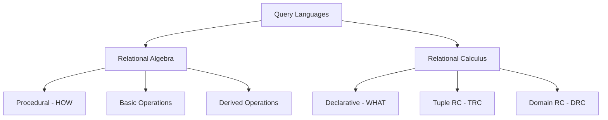

# Relational Calculus and Relational Algebra

> [!info]- Quick Reference
> **Class**: [[DBMS]]  
> **Date**: 2025-09-12  
> **Topics**: RC, RA, Query Languages  
> **Prerequisites**: [[Database Fundamentals]], [[Set Theory]]  
> **Next**: [[SQL Fundamentals]], [[Query Optimization]]

## 📋 Table of Contents
- [[#🎯 Learning Objectives]]
- [[#📚 Theoretical Foundation]]
- [[#🔧 Relational Algebra Operations]]
- [[#🧮 Relational Calculus]]
- [[#💡 Practical Examples]]
- [[#🔗 Relationship to SQL]]
- [[#📝 Practice Problems]]
- [[#🔍 Quick Reference]]

---

## 🎯 Learning Objectives

> [!success]- By the end of this topic, you should be able to:
> - [ ] Distinguish between procedural (RA) and declarative (RC) query languages
> - [ ] Apply all relational algebra operations correctly
> - [ ] Write complex queries using TRC and DRC
> - [ ] Convert between RA, RC, and SQL representations
> - [ ] Analyze query equivalence and optimization opportunities

---

## 📚 Theoretical Foundation

### Core Concepts

> [!note] **Key Distinction**
> - **Relational Algebra (RA)**: *Procedural* - specifies **HOW** to get data
> - **Relational Calculus (RC)**: *Declarative* - specifies **WHAT** data you want



### Historical Context
- **Developed by**: Edgar F. Codd (1970 s)
- **Significance**: Theoretical foundation for all relational databases
- **Modern Usage**: Basis for SQL and query optimization

---

## 🔧 Relational Algebra Operations

### Basic (Primitive) Operations

> [!info]- Operation Categories
> **Set Operations**: Union, Intersection, Difference
> **Relational Operations**: Selection, Projection, Cartesian Product, Rename

#### 1️⃣ Selection ($\sigma$)

> [!example]- Selection Operation
> **Purpose**: Filter rows based on conditions  
> **Syntax**: $\sigma_{\text{condition}}(\text{Relation})$
> 
> ```
> σ_{age > 18}(Student)              // Students older than 18
> σ_{dept='CS' ∧ gpa>3.5}(Student)   // CS students with high GPA  
> σ_{salary≥50000 ∨ exp>5}(Employee) // Well-paid OR experienced
> ```

**Properties of Selection**:
- **Commutative**: $\sigma_{C1}(\sigma_{C2}(R)) = \sigma_{C2}(\sigma_{C1}(R))$
- **Cascading**: $\sigma_{C1 \land C2}(R) = \sigma_{C1}(\sigma_{C2}(R))$
- **Size**: $|\sigma_C(R)| \leq |R|$

#### 2️⃣ Projection ($\pi$)

> [!example]- Projection Operation
> **Purpose**: Select specific columns, remove duplicates  
> **Syntax**: $\pi_{\text{attributes}}(\text{Relation})$
> 
> ```
> π_{Name}(Student)                   // Only student names
> π_{Name,Age}(Student)               // Names and ages  
> π_{Dept,COUNT(*)}(Employee)         // Count by department
> ```

**Properties of Projection**:
- **Idempotent**: $\pi_A(\pi_A(R)) = \pi_A(R)$
- **Composition**: $\pi_{A}(\pi_{A \cup B}(R)) = \pi_A(R)$
- **Size**: $|\pi_A(R)| \leq |R|$

#### 3️⃣ Rename ($\rho$)

> [!example]- Rename Operation
> **Purpose**: Change relation/attribute names  
> **Syntax**: $\rho_{\text{new_name}}(\text{Relation})$
> 
> ```
> ρ_{S}(Student)                      // Rename relation to S
> ρ_{S(ID,Name,Age)}(Student)         // Rename relation and attributes
> ρ_{StudentName←Name}(Student)       // Rename specific attribute
> ```

#### 4️⃣ Union ($\cup$)

> [!warning] **Union Compatibility Required**
> Both relations must have:
> - Same number of attributes
> - Compatible data types in corresponding positions

> [!example]- Union Operation
> ```
> CS_Students ∪ Math_Students         // All students from both depts
> Undergrad ∪ Graduate               // All students
> ```

**Properties**:
- **Commutative**: $R \cup S = S \cup R$
- **Associative**: $(R \cup S) \cup T = R \cup (S \cup T)$
- **Idempotent**: $R \cup R = R$

#### 5️⃣ Difference ($-$)

> [!example]- Difference Operation
> **Purpose**: Tuples in first relation but not in second
> 
> ```
> All_Students - Graduated_Students   // Current students
> Enrolled - Dropped                 // Active enrollments
> ```

**Properties**:
- **Not Commutative**: $R - S \neq S - R$
- **Identity**: $R - \emptyset = R$
- **Self**: $R - R = \emptyset$

#### 6️⃣ Cartesian Product ($\times$)

> [!example]- Cartesian Product
> **Purpose**: All possible tuple combinations
> 
> ```
> Student × Course                    // All student-course pairs
> ```
> 
> If Student has 100 rows and Course has 50 rows:  
> Result = 100 × 50 = 5,000 rows

**Properties**:
- **Size**: $|R \times S| = |R| \times |S|$
- **Attributes**: $attrs (R \times S) = attrs (R) \cup attrs (S)$

### Derived Operations

#### 🔗 Join Operations

> [!info]- Join Family Tree
> ```
> Joins
> ├── Natural Join (⋈)
> ├── Theta Join (⋈θ)
> │   └── Equi Join (special case)
> └── Outer Joins
>     ├── Left Outer (⟕)
>     ├── Right Outer (⟖)
>     └── Full Outer (⟗)
> ```

##### Natural Join (⋈)

> [!example]- Natural Join
> **Automatic joining on common attributes**
> 
> ```
> Student (ID, Name, DeptID) ⋈ Department (DeptID, DeptName)
> Result: (ID, Name, DeptID, DeptName)
> ```
> 
> **Process**:
> 1. Cartesian product
> 2. Select where common attributes are equal
> 3. Remove duplicate columns

##### Theta Join (⋈θ)

> [!example]- Theta Join
> **Join with any condition θ**
> 
> ```
> Employee ⋈_{Employee. DeptID = Department. ID} Department
> Student ⋈_{Student. Age > Course. MinAge} Course
> ```

##### Outer Joins

> [!tip]- When to Use Outer Joins
> Use when you need to preserve tuples that don't have matches:
> - **Left Outer**: Keep all from left table
> - **Right Outer**: Keep all from right table  
> - **Full Outer**: Keep all from both tables

```
Student ⟕ Enrollment    // All students, even non-enrolled
Department ⟖ Employee   // All employees, even if dept doesn't exist
Student ⟗ Course       // All combinations, with NULLs for non-matches
```

#### ➗ Division Operation ($\div$)

> [!important] **Division for "ALL" Queries**
> Use division when you need "for all" relationships

> [!example]- Division Examples
> ```
> // Students who took ALL required courses
> Student_Courses ÷ Required_Courses
> 
> // Suppliers who supply ALL parts
> Supplier_Parts ÷ All_Parts
> ```
> 
> **Formal Definition**:
> $R \div S = \{t | t \in \pi_{R-S}(R) \land \forall s \in S : (t \circ s) \in R\}$

#### 📊 Aggregate Operations

> [!example]- Aggregation Syntax
> **Notation**: $G_{F (A)}(R)$
> - G: Grouping attributes
> - F: Aggregate function
> - A: Target attribute
> 
> ```
> _{COUNT (*)}(Student)                // Total students
> Dept_{AVG (Salary)}(Employee)       // Average salary by department
> Year_{MAX (GPA), MIN (GPA)}(Student)  // GPA range by year
> ```

**Common Aggregate Functions**:
- `COUNT (*)` - Count tuples
- `SUM (attr)` - Sum values
- `AVG (attr)` - Average
- `MIN (attr)` - Minimum
- `MAX (attr)` - Maximum

---

## 🧮 Relational Calculus

### Tuple Relational Calculus (TRC)

> [!note]- TRC Fundamentals
> **General Form**: $\{t | P (t)\}$  
> - `t`: tuple variable
> - `P (t)`: predicate (logical formula)

#### TRC Components

**1. Atomic Formulas**:
- $t \in R$ (t belongs to relation R)
- $t.A \theta c$ (attribute comparison with constant)  
- $t.A \theta s.B$ (comparison between tuple attributes)

**2. Logical Connectives**:
- $\land$ (AND), $\lor$ (OR), $\lnot$ (NOT)

**3. Quantifiers**:
- $\exists t (P (t))$ (existential: "there exists")
- $\forall t (P (t))$ (universal: "for all")

> [!example]- TRC Examples
> 
> **Simple Selection**:
> ```
> {s | s ∈ Student ∧ s.age > 18}     // Students older than 18
> ```
> 
> **Existential Quantifier**:
> ```
> {s | s ∈ Student ∧ ∃e (e ∈ Enrollment ∧ 
>      e.StudentID = s.ID ∧ e.Grade = 'A')}
> // Students who got at least one 'A'
> ```
> 
> **Universal Quantifier**:
> ```
> {s | s ∈ Student ∧ ∀c (c ∈ Course ∧ c.Dept = 'CS' → 
>      ∃e (e ∈ Enrollment ∧ e.StudentID = s.ID ∧ e.CourseID = c.ID))}
> // Students enrolled in ALL CS courses
> ```

### Domain Relational Calculus (DRC)

> [!note]- DRC Fundamentals
> **General Form**: $\{⟨x_1, x_2, ..., x_n⟩ | P (x_1, x_2, ..., x_n)\}$
> - $x_i$: domain variables (values from attribute domains)
> - Focus on individual attribute values rather than entire tuples

> [!example]- DRC Examples
> 
> **Names of students older than 20**:
> ```
> {⟨N⟩ | ∃A,I (⟨I, N, A⟩ ∈ Student ∧ A > 20)}
> ```
> 
> **Student-Course pairs for CS courses**:
> ```
> {⟨S, C⟩ | ∃G (⟨S, C, G⟩ ∈ Enrollment) ∧ 
>          ∃D,Cr (⟨C, D, Cr⟩ ∈ Course ∧ D = 'CS')}
> ```

### Safety of Expressions

> [!warning] **Safe Expressions Only**
> RC expressions must be "safe" - producing finite results
> 
> **Unsafe Example**:
> ```
> {t | t ∉ Student}    // All tuples NOT in Student (infinite!)
> ```
> 
> **Safe Version**:
> ```
> {t | t ∈ Person ∧ t ∉ Student}    // People who aren't students
> ```

---

## 💡 Practical Examples

### Example Database Schema

```
Student (ID, Name, Age, DeptID, GPA)
Course (CourseID, Title, Credits, DeptID)
Enrollment (StudentID, CourseID, Grade, Semester)
Department (DeptID, DeptName, Building)
```

### Complex Query Examples

> [!example]- Query 1: High-performing CS students
> 
> **English**: Find names of CS students with GPA > 3.5
> 
> **Relational Algebra**:
> ```
> π_{Name}(σ_{DeptID='CS' ∧ GPA>3.5}(Student))
> ```
> 
> **TRC**:
> ```
> {s.Name | s ∈ Student ∧ s.DeptID = 'CS' ∧ s.GPA > 3.5}
> ```
> 
> **DRC**:
> ```
> {⟨N⟩ | ∃I,A,D,G (⟨I, N, A, D, G⟩ ∈ Student ∧ D = 'CS' ∧ G > 3.5)}
> ```
> 
> **SQL**:
> ```sql
> SELECT Name FROM Student 
> WHERE DeptID = 'CS' AND GPA > 3.5;
> ```

> [!example]- Query 2: Students enrolled in all CS courses
> 
> **English**: Find students who are enrolled in ALL CS courses
> 
> **Relational Algebra**:
> ```
> π_{StudentID}(Enrollment) ÷ π_{CourseID}(σ_{DeptID='CS'}(Course))
> ```
> 
> **TRC**:
> ```
> {s | s ∈ Student ∧ ∀c (c ∈ Course ∧ c.DeptID = 'CS' → 
>      ∃e (e ∈ Enrollment ∧ e.StudentID = s.ID ∧ e.CourseID = c.CourseID))}
> ```

> [!example]- Query 3: Average GPA by department
> 
> **Relational Algebra**:
> ```
> DeptID_{AVG (GPA)}(Student)
> ```
> 
> **SQL**:
> ```sql
> SELECT DeptID, AVG (GPA) 
> FROM Student 
> GROUP BY DeptID;
> ```

---

## 🔗 Relationship to SQL

> [!tip]- SQL incorporates both RA and RC concepts
> - **SELECT**: Projection (π) + Selection (σ)
> - **FROM**: Relations and Joins
> - **WHERE**: Selection conditions
> - **GROUP BY**: Aggregation
> - **HAVING**: Selection on groups

### Translation Examples

| Operation   | RA                           | SQL                               |
| ----------- | ---------------------------- | --------------------------------- |
| Selection   | $\sigma_{age>18}(Student)$   | `WHERE age > 18`                  |
| Projection  | $\pi_{Name, Age}(Student)$   | `SELECT Name, Age`                |
| Join        | $Student \bowtie Department$ | `Student NATURAL JOIN Department` |
| Union       | $R \cup S$                   | `R UNION S`                       |
| Aggregation | $Dept_{COUNT (*)}(Student)$  | `GROUP BY Dept`                   |

---

## 📝 Practice Problems

> [!question]- Problem Set 1: Basic Operations
> 
> Given relations:
> - Employee (ID, Name, Salary, DeptID)
> - Department (DeptID, DeptName, Manager)
> 
> Write RA expressions for:
> 1. Employees earning more than $50,000
> 2. Names of employees in 'Engineering' department
> 3. All employee-department combinations
> 
> > [!success]- Solutions
> > 1. $\sigma_{Salary > 50000}(Employee)$
> > 2. $\pi_{Name}(\sigma_{DeptName='Engineering'}(Employee \bowtie Department))$
> > 3. $Employee \times Department$

> [!question]- Problem Set 2: Complex Queries
> 
> Using the student database schema above:
> 
> 4. Students who have never enrolled in any course
> 5. Courses that no student has enrolled in
> 6. Students with perfect attendance (enrolled in all offered courses)
> 
> > [!success]- Solutions
> > 1. **RA**: $\pi_{ID}(Student) - \pi_{StudentID}(Enrollment)$
> > 2. **RA**: $\pi_{CourseID}(Course) - \pi_{CourseID}(Enrollment)$
> > 3. **RA**: $\pi_{StudentID}(Enrollment) \div \pi_{CourseID}(Course)$

> [!question]- Problem Set 3: Set Operations Scenario
> 
> **Given**: 
> - 60 total students
> - 35 like pizza
> - 28 like burgers  
> - 12 like both
> 
> **Find**:
> 1. Students who like pizza OR burgers
> 2. Students who like only pizza
> 3. Students who like neither
> 
> > [!success]- Solutions
> > 4. $|Pizza \cup Burgers| = 35 + 28 - 12 = 51$
> > 5. $|Pizza - Burgers| = 35 - 12 = 23$
> > 6. $60 - 51 = 9$ students like neither

---

## 🔍 Quick Reference

### Operation Symbols Quick Guide

| Symbol           | Operation         | Example                 |
| ---------------- | ----------------- | ----------------------- |
| $\sigma$         | Selection         | $\sigma_{age>18}(R)$    |
| $\pi$            | Projection        | $\pi_{name, age}(R)$    |
| $\rho$           | Rename            | $\rho_{S}(R)$           |
| $\cup$           | Union             | $R \cup S$              |
| $\cap$           | Intersection      | $R \cap S$              |
| $-$              | Difference        | $R - S$                 |
| $\times$         | Cartesian Product | $R \times S$            |
| $\bowtie$        | Natural Join      | $R \bowtie S$           |
| $\bowtie_\theta$ | Theta Join        | $R \bowtie_{R.a=S.b} S$ |
| $\div$           | Division          | $R \div S$              |

### Precedence Rules
1. **Highest**: $\sigma, \pi, \rho$ (unary operations)
2. **Medium**: $\times, \bowtie$ (binary operations)  
3. **Lowest**: $\cup, \cap, -$ (set operations)

### Common Query Patterns

> [!tip]- Query Pattern Library
> 
> **"Students who took course X"**:
> ```
> π_{Name}(σ_{CourseID='X'}(Student ⋈ Enrollment))
> ```
> 
> **"Courses with no enrollments"**:
> ```
> π_{CourseID}(Course) - π_{CourseID}(Enrollment)
> ```
> 
> **"Students in same department as John"**:
> ```
> π_{Name}(σ_{DeptID = (π_{DeptID}(σ_{Name='John'}(Student)))}(Student))
> ```

---

## 🔗 Related Notes

- [[SQL Fundamentals]] - Practical application of RA/RC concepts
- [[Database Design]] - Designing relations for efficient queries
- [[Query Optimization]] - How DBMS optimizes RA expressions
- [[Normalization]] - Structuring relations properly
- [[DBMS Architecture]] - How query processors work

---

> [!summary]- Key Takeaways
> 1. **RA is procedural** (how), **RC is declarative** (what)
> 2. Both are **mathematically equivalent** in expressive power
> 3. **SQL combines both approaches** - declarative syntax with procedural optimization
> 4. **Understanding these concepts** is crucial for database design and optimization
> 5. **Practice with complex queries** builds intuition for database problem-solving

---

*Last updated: 2025-09-12*  
*Next review: Before DBMS exam*

#DBMS #RelationalAlgebra #RelationalCalculus #Database #Theory #SQL #QueryLanguages