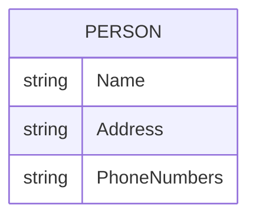
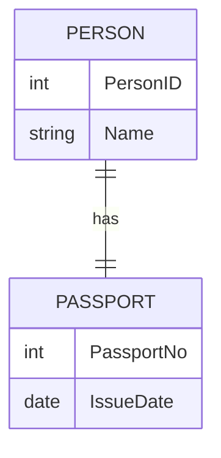
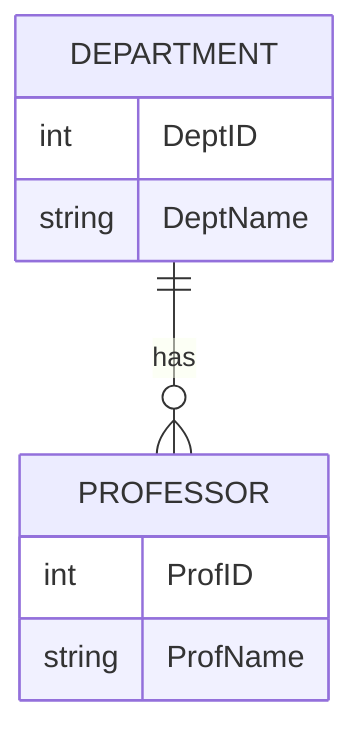
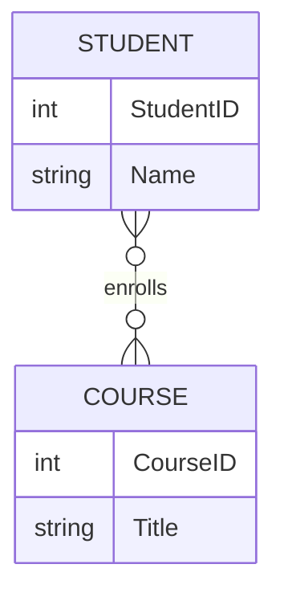
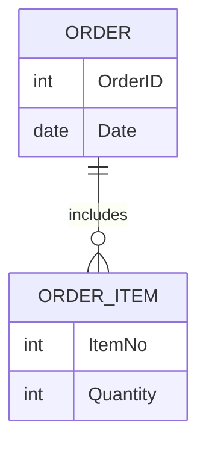
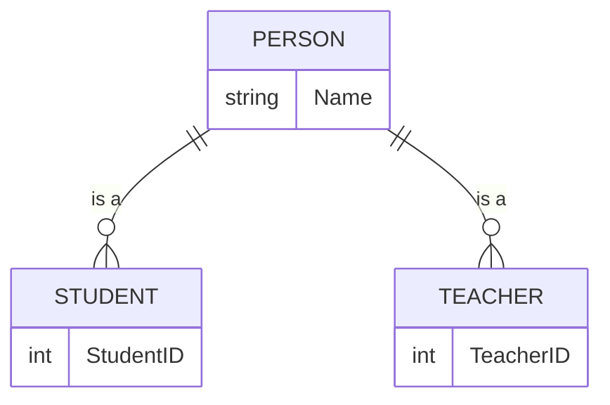
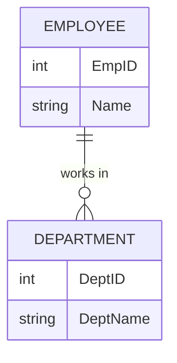
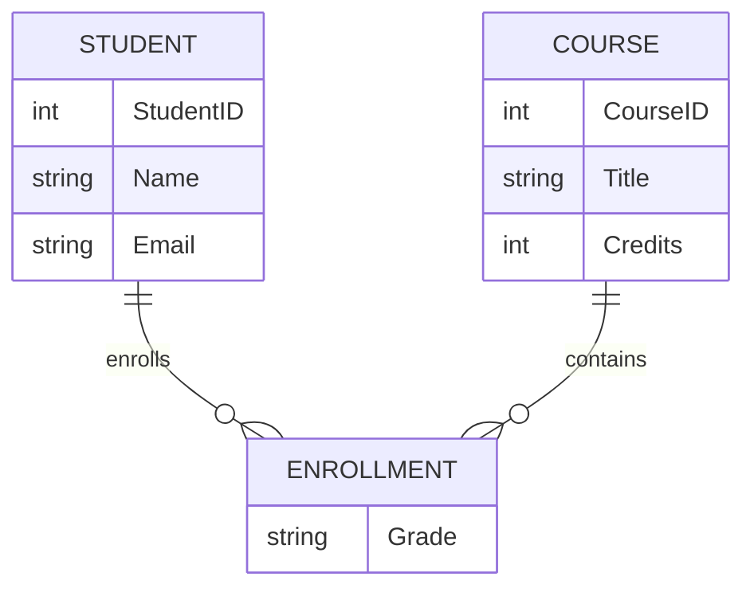
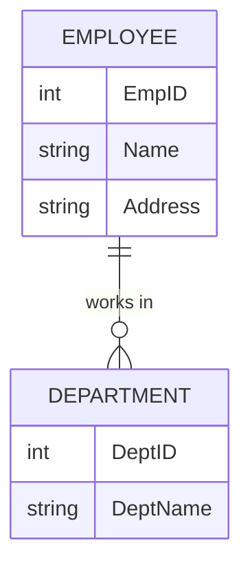

**Class**:  [[DBMS]]

**Title:** ER Models

**Date:** 04 08 2025

**Time:** 15:02

# Entity-Relationship (ER) Model Full Notes

The **Entity-Relationship (ER) Model** is a conceptual approach to database design, representing real-world entities and their relationships.

---

## 1. Introduction

- ER model proposed by Peter Chen in 1976.
- Used for high-level database design.
- Visualized using ER Diagrams.

---

## 2. Entities

- **Entity:** An object with a distinct existence (person, place, thing).
    - Example: STUDENT, COURSE, EMPLOYEE
- **Entity Set:** Collection of similar entities.

---

## 3. Attributes

- **Attribute:** Property that describes an entity.
    - Example: Student Name, Age
- **Types of Attributes:**
    - **Simple:** Indivisible (e.g., Age)
    - **Composite:** Divisible into subparts (e.g., Name → FirstName, LastName)
    - **Derived:** Computed from other attributes (e.g., Age from DOB)
    - **Multi-valued:** Can have multiple values (e.g., Phone Numbers)

### Example: Composite and Multi-valued Attributes

---

## 4. Relationships

- **Relationship:** Association among two or more entities.
    - Example: STUDENT enrolls in COURSE
- **Relationship Set:** Collection of similar relationships.

---

## 5. Types of Relationships

### One-to-One (1:1)

Each entity in Set A is related to at most one entity in Set B, and vice versa.

#### Example: Person and Passport

- Each person owns one passport, and each passport belongs to one person.

---

### One-to-Many (1:N)

An entity in Set A can be related to multiple entities in Set B, but each entity in Set B is related to only one in Set A.

#### Example: Department and Professor

- One department has many professors, but each professor belongs to one department.

---

### Many-to-Many (M:N)

Entities in Set A and Set B can be related to multiple entities in each set.

#### Example: Student and Course

- Each student can enroll in multiple courses, and each course can have multiple students.

---

## 6. ER Diagram Notation

- **Rectangle:** Entity
- **Ellipse:** Attribute
- **Double Ellipse:** Multi-valued Attribute
- **Diamond:** Relationship
- **Double Rectangle:** Weak Entity
- **Lines:** Connect entities, attributes, relationships

---

## 7. Advanced Concepts

### Weak Entity

- Cannot be uniquely identified by its own attributes.
- Exists only with a strong entity (has a partial key).
- Represented by double rectangle.

#### Example: Weak Entity

### Generalization & Specialization

- **Generalization:** Combining similar entities into a super-entity.
- **Specialization:** Dividing a super-entity into sub-entities based on distinguishing features.

#### Example: Generalization

### Aggregation

- Represents a relationship set as a higher-level entity set.
- Used for modeling relationships among relationships.

---

## 8. Cardinality & Participation

- **Cardinality:** Number of entities associated via a relationship.
    - 1:1, 1:N, M:N
- **Participation:**
    - **Total:** All entities participate in a relationship.
    - **Partial:** Some entities participate.

#### Partial Participation

---

## 9. Sample ER Diagrams

### University Database Example

### Company Example

## Min-Max Representation

---

## 10. Best Practices

- Use meaningful names for entities and attributes.
- Avoid data redundancy.
- Indicate primary and foreign keys clearly.
- Normalize data when possible.
- Document assumptions and business rules.

---

## 11. Summary Table

| Component      | Symbol      | Example         | Description                  |
|----------------|-------------|-----------------|------------------------------|
| Entity         | Rectangle   | STUDENT         | Real-world object            |
| Attribute      | Ellipse     | Name, Email     | Property of entity           |
| Relationship   | Diamond     | ENROLLS         | Association of entities      |
| Weak Entity    | Double Rectangle | ORDER_ITEM  | Needs strong entity for PK   |
| Multi-valued Attribute | Double Ellipse | PhoneNumbers | Multiple values allowed      |

---

# Work

- [ ] 

---
