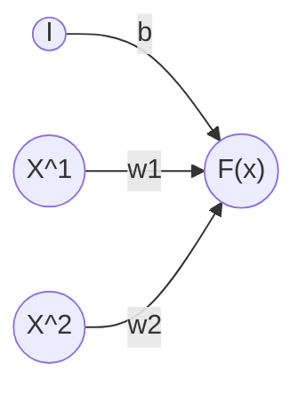

**Class**: [[Elements of AI]]

**Title:** Linear Regression

**Date:** 26-08-2025

**Time:** 13:28

**Tags:** #AI

**Related:** [[Create a simple program for Regression Problem]]
# Topic

---
# Keywords

--- 
# Notes

## Linear Regression

$$F(x) = w^tx + b$$
## Mathematical Derivation of Linear Regression

Let Dataset of n samples:

$$\{(x_1,y_1),(x_2,y_2),...,(x_n,y_n)]\}$$
Where $x_i$ is the independent variable(feature) and $y_i$ is the dependent variable(target).

We want to fit a linear model of the form
$$y = mx +b$$

### 1. Loss Function(Objective)

The Loss function is the the Mean Squared Error(MSE):
$$
\text{J}(m, b) = \frac{1}{N} \sum_{i=1}^N \left( y_i - (mx_i + b) \right)^2
$$
### 2. Partial Differentiation

With respect to $m$:
$$
\frac{\partial\, \text{J}(m, b)}{\partial m} = -\frac{2}{N} \sum_{i=1}^N x_i \left( y_i - (mx_i + b) \right)
$$

With respect to $b$
$$
\frac{\partial\, \text{J}(m, b)}{\partial b} = -\frac{2}{N} \sum_{i=1}^N \left( y_i - (mx_i + b) \right)
$$
### 3. Solving for $m$ and $b$ 
$$
b = \bar{y} - m\bar{x}
$$

$$
m = \frac{N \sum_{i=1}^N x_i y_i - \sum_{i=1}^N x_i \sum_{i=1}^N y_i}
       {N \sum_{i=1}^N x_i^2 - \left( \sum_{i=1}^N x_i \right)^2}
$$
 
### 4. Final Formula 
Define the means:
$$
\bar{x} = \frac{1}{N} \sum_{i=1}^N x_i
\qquad
\bar{y} = \frac{1}{N} \sum_{i=1}^N y_i
$$
Then the slope $m$ is:
$$
m = \frac{{\sum^n_{i=1}({x_i - \bar{x}}){(y_i - \bar{y})}}}{\sum_{i=1}^n{(x_i -x)^2}}
$$
and $b$ is:
$$
b = \bar{y} - m\bar{x}
$$

---
# Work

- [ ] 

---
