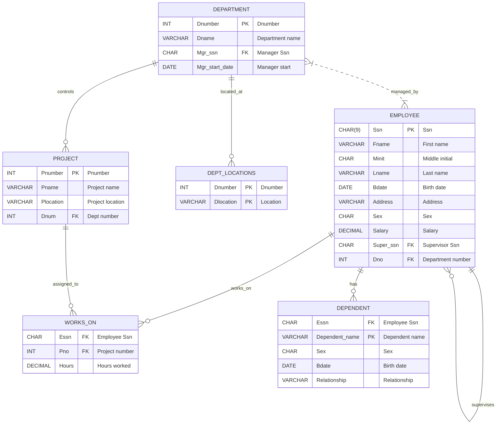

# DBMS Lab Experiment 03
## To understand DDL and DML Command
---
- **Course:** DBMS
- **Name:** Devesh Chandra Srivastava
- **SapID:** 590017127
- **Batch:** 66
- **Semester:** 3
- **Date:** 2025-10-06
---

## ER Diagram



---

## ER → Relational Mapping

**Relations:**

1. EMPLOYEE (<u>Ssn</u>, Fname, Minit, Lname, Bdate, Address, Sex, Salary, Super_ssn, Dno)  
2. DEPARTMENT (<u>Dnumber</u>, Dname, Mgr_ssn, Mgr_start_date)  
3. DEPT_LOCATIONS (<u>Dnumber, Dlocation</u>)  
4. PROJECT (<u>Pnumber</u>, Pname, Plocation, Dnum)  
5. WORKS_ON (<u>Essn, Pno</u>, Hours)  
6. DEPENDENT (<u>Essn, Dependent_name</u>, Sex, Bdate, Relationship)

*Note: Primary keys are underlined. Foreign keys are added when creating the order and relationship tables.*

---

## 1. Table Creation

### Creating EMPLOYEE Table
```sql
CREATE TABLE EMPLOYEE (
    Fname VARCHAR(15) NOT NULL,
    Minit CHAR(1),
    Lname VARCHAR(15) NOT NULL,
    Ssn CHAR(9) NOT NULL,
    Bdate DATE,
    Address VARCHAR(30),
    Sex CHAR(1),
    Salary DECIMAL(10,2),
    Super_ssn CHAR(9),
    Dno INT NOT NULL,
    PRIMARY KEY (Ssn),
    FOREIGN KEY (Super_ssn) REFERENCES EMPLOYEE(Ssn),
    FOREIGN KEY (Dno) REFERENCES DEPARTMENT(Dnumber)
);
```

### Creating DEPARTMENT Table
```sql
CREATE TABLE DEPARTMENT (
    Dname VARCHAR(15) NOT NULL,
    Dnumber INT NOT NULL,
    Mgr_ssn CHAR(9) NOT NULL,
    Mgr_start_date DATE,
    PRIMARY KEY (Dnumber),
    UNIQUE (Dname),
    FOREIGN KEY (Mgr_ssn) REFERENCES EMPLOYEE(Ssn)
);
```

### Creating DEPT_LOCATIONS Table
```sql
CREATE TABLE DEPT_LOCATIONS (
    Dnumber INT NOT NULL,
    Dlocation VARCHAR(15) NOT NULL,
    PRIMARY KEY (Dnumber, Dlocation),
    FOREIGN KEY (Dnumber) REFERENCES DEPARTMENT(Dnumber)
);
```

### Creating PROJECT Table
```sql
CREATE TABLE PROJECT (
    Pname VARCHAR(15) NOT NULL,
    Pnumber INT NOT NULL,
    Plocation VARCHAR(15),
    Dnum INT NOT NULL,
    PRIMARY KEY (Pnumber),
    UNIQUE (Pname),
    FOREIGN KEY (Dnum) REFERENCES DEPARTMENT(Dnumber)
);
```

### Creating WORKS_ON Table
```sql
CREATE TABLE WORKS_ON (
    Essn CHAR(9) NOT NULL,
    Pno INT NOT NULL,
    Hours DECIMAL(3,1),
    PRIMARY KEY (Essn, Pno),
    FOREIGN KEY (Essn) REFERENCES EMPLOYEE(Ssn),
    FOREIGN KEY (Pno) REFERENCES PROJECT(Pnumber)
);
```

### Creating DEPENDENT Table
```sql
CREATE TABLE DEPENDENT (
    Essn CHAR(9) NOT NULL,
    Dependent_name VARCHAR(15) NOT NULL,
    Sex CHAR(1),
    Bdate DATE,
    Relationship VARCHAR(8),
    PRIMARY KEY (Essn, Dependent_name),
    FOREIGN KEY (Essn) REFERENCES EMPLOYEE(Ssn)
);
```

---

## 2. Inserting Sample Data

### Data for DEPARTMENT
```sql
INSERT INTO DEPARTMENT (Dname, Dnumber, Mgr_ssn, Mgr_start_date) VALUES
('Research', 5, '333445555', '1988-05-22'),
('Administration', 4, '987654321', '1995-01-01'),
('Headquarters', 1, '888665555', '1981-06-19');
```

### Data for EMPLOYEE
```sql
INSERT INTO EMPLOYEE (Fname, Minit, Lname, Ssn, Bdate, Address, Sex, Salary, Super_ssn, Dno) VALUES
('John', NULL, 'Smith',    '123456789', '1965-01-09', '731 Fondren, Houston TX', 'M', 30000.00, '333445555', 5),
('Franklin', NULL, 'Wong', '333445555', '1965-12-08', '638 Voss, Houston TX',     'M', 40000.00, '888665555', 5),
('Alicia', NULL, 'Zelaya', '999887777', '1968-01-19', '3321 Castle, Spring TX',   'F', 25000.00, '987654321', 4);
```

### Data for PROJECT
```sql
INSERT INTO PROJECT (Pname, Pnumber, Plocation, Dnum) VALUES
('ProductX', 1,  'Bellaire', 5),
('ProductY', 2,  'Sugarland', 5),
('ProductZ', 3,  'Houston',   5),
('Computerization', 10, 'Stafford', 4),
('Reorganization', 20, 'Houston', 1),
('Newbenefits', 30, 'Stafford', 4);
```

### Data for WORKS_ON
```sql
INSERT INTO WORKS_ON (Essn, Pno, Hours) VALUES
('123456789', 1,  32.5),
('123456789', 2,   7.5),
('666884444', 3,  40.0),
('453453453', 1,  20.0),
('453453453', 2,  20.0),
('333445555', 2,  10.0),
('333445555', 3,  10.0),
('333445555',10,  10.0),
('333445555',20,  10.0),
('333445555',20,  10.0),
('999887777',30,  30.0),
('999887777',10,  10.0),
('987987987',10,  35.0),
('987987987',30,   5.0),
('987654321',30,  20.0),
('987654321',20,  15.0),
('888665555',20,  NULL);
```

### Data for DEPENDENT
```sql
INSERT INTO DEPENDENT (Essn, Dependent_name, Sex, Bdate, Relationship) VALUES
('333445555', 'Alice',     'F', '1986-04-04', 'Daughter'),
('333445555', 'Theodore',  'M', '1983-10-25', 'Son'),
('333445555', 'Joy',       'F', '1958-05-03', 'Spouse'),
('987654321', 'Abner',     'M', '1942-02-28', 'Spouse'),
('123456789', 'Michael',   'M', '1988-01-04', 'Son'),
('123456789', 'Alice',     'F', '1988-12-30', 'Daughter'),
('123456789', 'Elizabeth', 'F', '1967-05-05', 'Spouse');
```

### Data for DEPT_LOCATIONS
```sql
INSERT INTO DEPT_LOCATIONS (Dnumber, Dlocation) VALUES
(1, 'Houston'),
(4, 'Stafford'),
(5, 'Bellaire'),
(5, 'Houston'),
(5, 'Sugarland');
```

---

## 3. Exercise on Retrieving Records

### Q 1: Find the first and last names of all employees
```sql
SELECT Fname, Lname FROM EMPLOYEE;
```

#### Result
| Fname | Lname |
|-------|-------|
| John | Smith |
| Franklin | Wong |
| Alicia | Zelaya |
| ... | ... |

### Q 2: Retrieve the entire contents of the EMPLOYEE table
```sql
SELECT * FROM EMPLOYEE;
```

#### Result
| Fname | Minit | Lname | Ssn | Bdate | Address | Sex | Salary | Super_ssn | Dno |
|-------|-------|-------|-----|-------|---------|-----|--------|-----------|-----|
| John |  | Smith | 123456789 | 1965-01-09 | 731 Fondren, Houston TX | M | 30000.00 | 333445555 | 5 |
| Franklin |  | Wong | 333445555 | 1965-12-08 | 638 Voss, Houston TX | M | 40000.00 | 888665555 | 5 |
| Alicia |  | Zelaya | 999887777 | 1968-01-19 | 3321 Castle, Spring TX | F | 25000.00 | 987654321 | 4 |
| ... | ... | ... | ... | ... | ... | ... | ... | ... | ... |

### Q 3: List project names and locations
```sql
SELECT Pname, Plocation FROM PROJECT;
```

#### Result
| Pname | Plocation |
|-------|-----------|
| ProductX | Bellaire |
| ProductY | Sugarland |
| ProductZ | Houston |
| ... | ... |

### Q 4: List works_on entries with hours greater than 30
```sql
SELECT * FROM WORKS_ON WHERE Hours > 30;
```

#### Result
| Essn | Pno | Hours |
|------|-----|-------|
| 123456789 | 1 | 32.5 |
| 666884444 | 3 | 40.0 |
| 987987987 | 10 | 35.0 |
| ... | ... | ... |

### Q 5: Find dependents of employee '333445555'
```sql
SELECT Dependent_name, Relationship FROM DEPENDENT WHERE Essn = '333445555';
```

#### Result
| Dependent_name | Relationship |
|----------------|--------------|
| Alice | Daughter |
| Theodore | Son |
| Joy | Spouse |

---

## 4. Exercise on Updating Records

### Q 1: Change the salary of employee with Ssn '123456789' to 32000
```sql
UPDATE EMPLOYEE
SET Salary = 32000.00
WHERE Ssn = '123456789';
```

### Q 2: Change project 'Computerization' location to 'Houston'
```sql
UPDATE PROJECT
SET Plocation = 'Houston'
WHERE Pname = 'Computerization';
```

### Q 3: Set NULL hours in WORKS_ON to 0.0
```sql
UPDATE WORKS_ON
SET Hours = 0.0
WHERE Hours IS NULL;
```

---

## 5. Exercise on Deleting Records

### Q 1: Delete dependents named 'Joy' for employee '333445555'
```sql
DELETE FROM DEPENDENT
WHERE Essn = '333445555' AND Dependent_name = 'Joy';
```

### Q 2: Delete projects that have no assignments in WORKS_ON
```sql
DELETE FROM PROJECT
WHERE Pnumber NOT IN (SELECT Pno FROM WORKS_ON);
```

### Q 3: Delete department with Dnumber = 1
```sql
DELETE FROM DEPARTMENT WHERE Dnumber = 1;
-- Note: This will fail if referenced by foreign keys; remove referencing rows first or use ON DELETE CASCADE if intended.
```

---

## 6. Exercise on Altering Table Structure

### Q 1: Add a Telephone column to EMPLOYEE
```sql
ALTER TABLE EMPLOYEE
ADD Telephone VARCHAR(15);
```

### Q 2: Change Salary column precision to DECIMAL (12,2) (Postgres example)
```sql
ALTER TABLE EMPLOYEE
ALTER COLUMN Salary TYPE DECIMAL(12,2);
```

---

## 7. Exercise on Deleting Table Structure

### Q 1: Drop DEPENDENT table
```sql
DROP TABLE DEPENDENT;
```

---

## Verification Queries

### View All Tables
```sql
SELECT table_name
FROM information_schema.tables
WHERE table_schema = 'public';
```

### View Table Structure (psql meta-command)
```
\d EMPLOYEE
\d DEPARTMENT
\d PROJECT
```

### View Table Structure (SQL)
```sql
SELECT column_name, data_type, character_maximum_length
FROM information_schema.columns
WHERE table_name = 'employee';
```

### Count Records
```sql
SELECT COUNT(*) AS EmployeeCount FROM EMPLOYEE;
SELECT COUNT(*) AS ProjectCount FROM PROJECT;
SELECT COUNT(*) AS DepartmentCount FROM DEPARTMENT;
```

