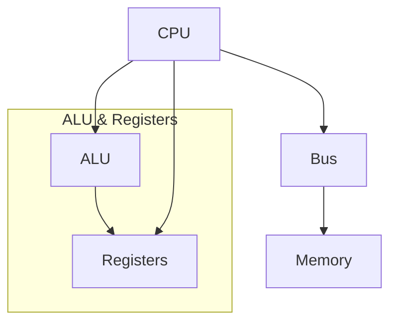

**Class**: Operating Systems

**Title:** Computer System Overview

**Date:** 05-08-2025

**Time:** 09:10

# Topic

---
# Keywords

- **Processor**
- **IO Module**
- **Main Memory**
- **System Bus**

--- 
# Notes

### Instruction Cycle

### Instruction Execution
1. Processor - Memory
2. Processor - I/O
3. Data Processing
4. Control

---
# Work

- [ ] 

---
