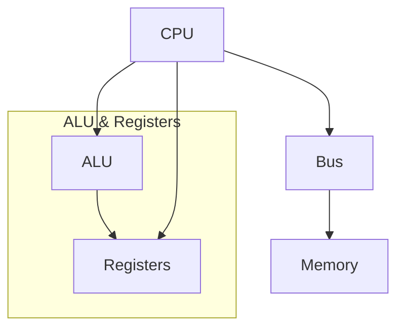
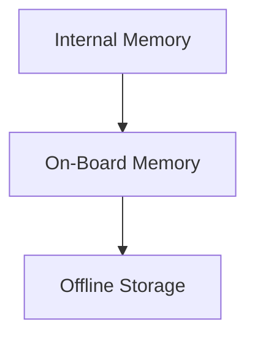
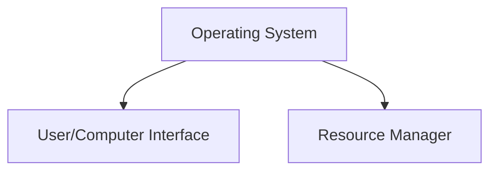

**Class**: [[Operating Systems]] 

**Title:** Computer System Overview

**Date:** 05-08-2025

**Time:** 09:10

**Tags:** #OS #Unit1

# Topic

---
# Keywords

- **Processor**
- **IO Module**
- **Main Memory**
- **System Bus**

--- 
# Notes

## Instruction Cycle

## Instruction Execution
1. Processor - Memory
2. Processor - I/O
3. Data Processing
4. Control

### Interrupt Signal
Used to throw errors and stop execution.
##### Types of Interrupt
1. Program: error in logic and execution
2. Timer: used by a time bound process
3. I/O: Due to IO errors
4. H/W failure: self explanatory 

## Storage

#### Memory Hierarchy

### Internal Storage 
1. Main Memory
2. Cache Memory
3. Register

#### Cache Memory Design

##### Cache Memory
Stores some data from the main memory.
Only keeps data that is under current execution

1. Cache Size
2. Cache Level
	-  Multiple Cache levels with different speeds depending on the proximity
3. Mapping Function
	- Maps the link between main memory and cache memory
	- Reflects change in main memory when cache memory is being changed
4. Replacement Algorithm
5. Write Policy
	- Cache write policies dictate _how data modifications in the cache are propagated to the main memory_. 

### On - Board Memory
1. CD - ROM
2. Hard Drive
3. DVD

### Offline Storage
1. Magnetic Tape

## Operating System

### Computer/User Interface

1. Program Development
2. Program Management
3. Access to I/O Devices
4. Controlled access to files
5. System Access
6. Error detection and response 
7. Accounting 
8. ISA
9. Application Binary Interface
10. API

### Resource Management

1. Computer Resources
	- Memory
	- I/O Access
	- Processing speed
	- Processing speed
2. Resource Control

---
# Work

- [ ] 

---
