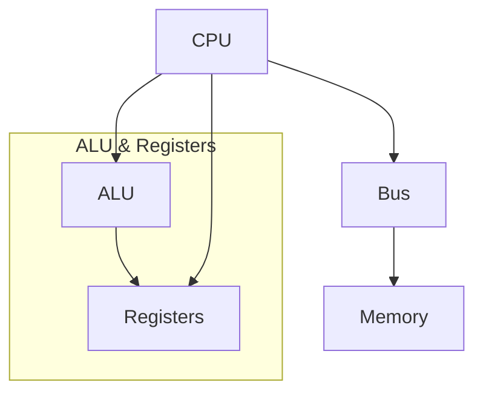
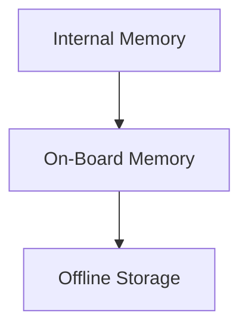

**Class**: Operating Systems

**Title:** Computer System Overview

**Date:** 05-08-2025

**Time:** 09:10

# Topic

---
# Keywords

- **Processor**
- **IO Module**
- **Main Memory**
- **System Bus**

--- 
# Notes

# Instruction Cycle

# Instruction Execution
1. Processor - Memory
2. Processor - I/O
3. Data Processing
4. Control

## Interrupt Signal
Used to throw errors and stop execution.
#### Types of Interrupt
1. Program: error in logic and execution
2. Timer: used by a time bound process
3. I/O: Due to IO errors
4. H/W failure: self explanatory 

# Storage

### Memory Hierarchy

## Internal Storage 
1. Main Memory
2. Cache Memory
3. Register

## On - Board Memory
1. CD - ROM
2. Hard Drive
3. DVD

## Offline Storage
1. Magnetic Tape

---
# Work

- [ ] 

---
