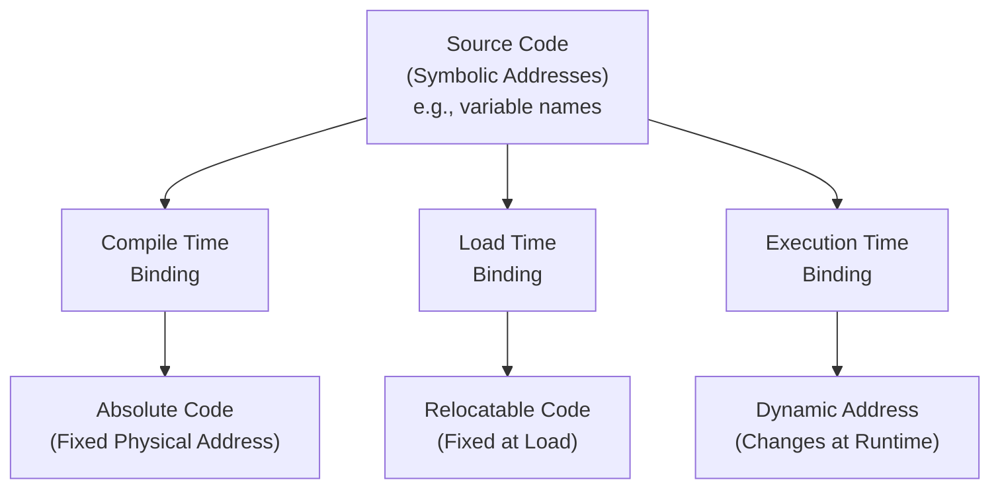
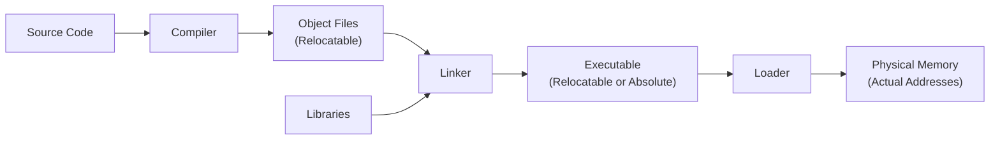
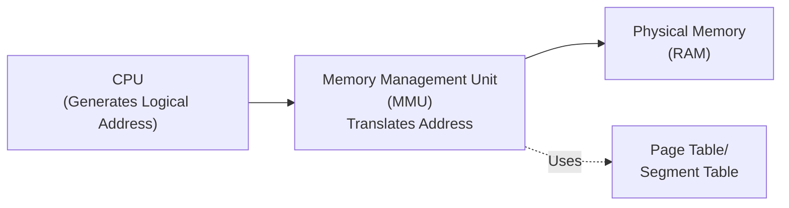
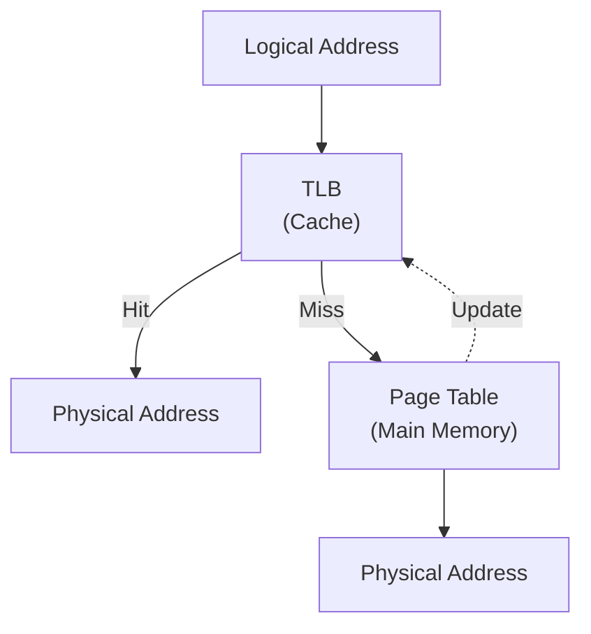

# Memory Management Unit & Address Translation

## Topic

Memory Management and Address Translation in Operating Systems

## Keywords

- Logical Address (Virtual Address)
- Physical Address
- Memory Management Unit (MMU)
- Address Translation
- Address Binding
- Base and Limit Registers
- Page Tables
- Segmentation

## Notes

### Address Binding

**Address Binding** is the process of mapping program instructions and data to actual memory addresses. It determines when and how symbolic addresses in a program are converted to actual memory locations.

#### Types of Address Binding

##### 1. Compile Time Binding

- **When**: During compilation
- **Process**: Compiler generates **absolute code** with fixed physical addresses
- **Characteristics**:
    - Address known at compile time
    - Must know exact memory location before compilation
    - If starting address changes, must recompile
- **Example**: Early MS-DOS `.COM` programs
- **Advantages**: Fastest execution (no translation needed)
- **Disadvantages**: Inflexible, no relocation possible

##### 2. Load Time Binding

- **When**: When program is loaded into memory
- **Process**: Compiler generates **relocatable code**; loader translates to physical addresses
- **Characteristics**:
    - Address determined when program loaded
    - Loader adds base address to all relative addresses
    - If starting address changes, must reload (not recompile)
- **Example**: Traditional executable formats with relocation tables
- **Advantages**: More flexible than compile-time; one compilation works for different locations
- **Disadvantages**: Cannot move process once loaded

##### 3. Execution Time Binding (Runtime Binding)

- **When**: During program execution
- **Process**: Address translation occurs dynamically using MMU
- **Characteristics**:
    - Logical addresses mapped to physical addresses at runtime
    - Process can move in memory during execution
    - Requires hardware support (MMU)
- **Example**: Modern operating systems with virtual memory
- **Advantages**: Maximum flexibility; supports swapping, paging, dynamic relocation
- **Disadvantages**: Overhead of address translation (mitigated by TLB)

#### Address Binding Example

Consider a simple instruction: `LOAD R1, x`

|Binding Type|Address Representation|When Resolved|
|---|---|---|
|**Source Code**|`x` (symbolic)|-|
|**Compile Time**|`MOV R1, [1000]` (absolute)|Compilation|
|**Load Time**|`MOV R1, [BASE+20]` → `[1000]` when loaded at BASE=980|Loading|
|**Execution Time**|`MOV R1, [20]` → Physical address via MMU|Every access|

#### Linking and Loading Process

### Dynamic Loading vs Dynamic Linking

#### Dynamic Loading

- Routine loaded only when called
- Better memory utilization
- Entire responsibility on program itself
- No special OS support needed

#### Dynamic Linking

- Linking postponed until execution
- **Stub** included in image for each library routine
- Stub replaced with address of routine when executed
- Requires OS support
- **Shared Libraries** (`.dll`, `.so`) are common examples
- Multiple processes can share one copy of library code

### Address Types

$ Logical\space Address \implies Virtual\space Address $

**Logical Address** is generated by CPU during program execution

- Also called **Virtual Address**
- Reference to memory location independent of physical memory
- Each process has its own logical address space (typically starts at 0)
- Programs work with logical addresses without knowing actual physical locations

$$ Physical\space Address \implies Actual\space Memory $$

**Physical Address** refers to actual location in RAM

- Real hardware memory address
- Managed by the operating system
- Multiple processes can have same logical address mapped to different physical addresses

### Address Translation Process

The translation from logical to physical addresses utilizes a **Memory Management Unit (MMU)**

## Memory Management Unit (MMU)

### MMU Functions

1. **Address Translation**: Converts logical addresses to physical addresses
2. **Memory Protection**: Ensures processes cannot access unauthorized memory
3. **Memory Mapping**: Maps virtual address space to physical memory
4. **Cache Management**: Works with TLB (Translation Lookaside Buffer) for fast lookups

### MMU Components

#### Base and Limit Registers (Simple Scheme)

- **Base Register**: Contains starting physical address
- **Limit Register**: Defines size of logical address space
- Physical Address = Base + Logical Address
- If Logical Address ≥ Limit → Error (trap to OS)

#### Page Table (Paging Scheme)

- Divides memory into fixed-size blocks called **pages** (logical) and **frames** (physical)
- Page table stores mapping of page number to frame number
- Logical Address = Page Number + Page Offset
- Physical Address = Frame Number + Page Offset

#### Segment Table (Segmentation)

- Divides program into logical segments (code, data, stack)
- Each segment has base address and limit
- Provides better logical organization than paging

### Translation Lookaside Buffer (TLB)

- High-speed cache for page table entries
- Stores recent address translations
- Significantly reduces memory access time
- Typical hit ratio: 95-99%

### Address Translation Example

**Paging Example:**

- Logical Address: 32 bits
- Page Size: 4 KB (2¹² bytes)
- Page Number: Upper 20 bits
- Offset: Lower 12 bits

If Logical Address = `0x00003ABC`:

- Page Number = `0x00003` (decimal 3)
- Offset = `0xABC` (decimal 2748)
- Look up Page 3 in page table → Frame Number (e.g., Frame 7)
- Physical Address = Frame 7 + Offset = `0x00007ABC`

### Memory Protection Mechanisms

1. **Protection Bits**: Read/Write/Execute permissions in page table
2. **Valid/Invalid Bit**: Indicates if page is in process's address space
3. **Privilege Levels**: User mode vs. Kernel mode access

### Advantages of Virtual Memory (via MMU)

- **Isolation**: Each process has separate address space
- **Protection**: Prevents unauthorized access between processes
- **Flexibility**: Programs larger than physical memory (via paging to disk)
- **Simplified Loading**: Programs can be loaded anywhere in physical memory
- **Sharing**: Multiple processes can share same physical pages (e.g., libraries)

### Common MMU Schemes Comparison

|Scheme|Unit Size|Advantages|Disadvantages|
|---|---|---|---|
|**Contiguous Allocation**|Entire process|Simple, fast|External fragmentation, no protection|
|**Paging**|Fixed (4KB-4MB)|No external fragmentation|Internal fragmentation, overhead|
|**Segmentation**|Variable|Logical organization|External fragmentation|
|**Segmented Paging**|Combined|Best of both|Complex, higher overhead|

---

## Work

- [x] Complete basic MMU concepts
- [x] Add address translation diagrams
- [x] Include TLB explanation
- [x] Add paging example with calculations
- [x] Explain address binding concepts
- [ ] Review different MMU implementations (x86, ARM, etc.)
- [ ] Study demand paging and page replacement algorithms
- [ ] Explore multi-level page tables
- [ ] Research modern MMU features (huge pages, PAE, SMEP)