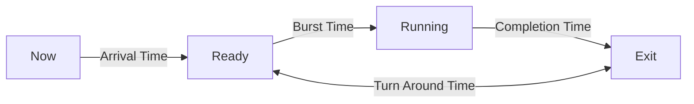

**Class**: 

**Title:** Process Time Management

**Date:** 18-08-2025

**Time:** 13:04

**Tags:**

**Related:**
# Topic

---
# Keywords

- Arrival Time
- Burst Time
- Completion time
- Turn Around Time
- Waiting time

--- 
# Notes

## Process Timings

- **Arrival Time(AT):** The time at which a process enters the ready queue
- **Burst Time(BT):** The total amount of CPU time a process needs for exectution
- **Completion Time:**  The time at which process finishes exection
- **Turn Around Time(TAT):** Total time a process spends in the system
	- TAT = CT - AT
- **Waiting Time(WT):** The total time a process spends in the ready queue
	- WT = TAT - BT
- **Response Time:** The time when a process arrives until it gets CPU for the first time. 
	- RT = First CPU start time - AT

---
# Work

- [ ] 

---
