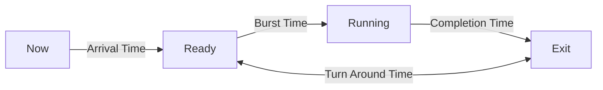
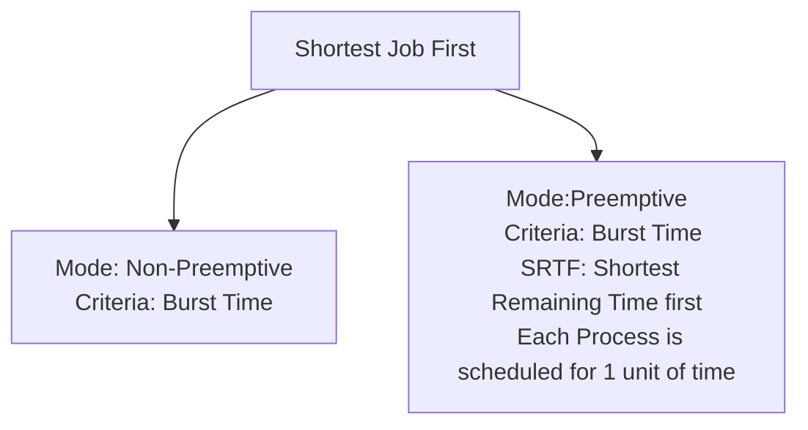

**Class**: 

**Title:** Process Time Management

**Date:** 18-08-2025

**Time:** 13:04

**Tags:**

**Related:**
# Topic

---
# Keywords

- Arrival Time
- Burst Time
- Completion time
- Turn Around Time
- Waiting time

--- 
# Notes

## Process Timings

- **Arrival Time(AT):** The time at which a process enters the ready queue
- **Burst Time(BT):** The total amount of CPU time a process needs for exectution
- **Completion Time:**  The time at which process finishes exection
- **Turn Around Time(TAT):** Total time a process spends in the system
	- TAT = CT - AT
- **Waiting Time(WT):** The total time a process spends in the ready queue
	- WT = TAT - BT
- **Response Time:** The time when a process arrives until it gets CPU for the first time. 
	- RT = First CPU start time - AT

## First Come First Serve(FCFS)

- **Non-preemptive CPU scheduling:** the earliest arriving ready process runs to completion.
- **Policy:** strict FIFO queue; ties broken by arrival order (stable).
- **Implementation:** enqueue on arrival; dispatcher always picks queue head.
- **Good for:** batch workloads, simple systems; minimal overhead.
- **Not good for:** interactive/time-sharing systems (large wait for short jobs).
- **Convoy effect:** one long job delays all following short jobs.
- **Starvation:** none (every process eventually runs).
- **Fairness:** order-based fairness, not size-aware.
- **Complexity:** O(1) per dispatch with a ready queue; O(n) total to simulate.
- **Metrics:**
  - Waiting time (WT) = start_time − arrival_time
  - Turnaround time (TAT) = completion_time − arrival_time
  - Response time (RT) = first_run_time − arrival_time (equals WT in FCFS)
- **Throughput/latency:** can be poor if long jobs arrive early; average waiting time tends to be high.
- **Mode:** Non-Preemptive
- **Criteria:** Arrival Time

**For Non Preemptive Systems the Waiting Time and Response Time are the Same**

```mermaid 
---
displayMode: compact
---
gantt
title FCFS Gantt: P1(3,4) P2(5,3) P3(0,2) P4(5,1) P5(4,3)
dateFormat  X
axisFormat %s
section CPU Timeline
P3 : 0, 2
Idle : 2, 3
P1  : 3, 7
P5  : 7, 10
P2  : 10, 13
P4  : 13, 14
```

## Shortest Job First(SJF)

### Non - Preemptive
- **Criteria:** Burst Time
- **Mode:** Non - Preemptive
- Removes Convoy effect

#### Example 1

```mermaid
---
displayMode: compact
---
gantt
title SJF
dateFormat X
axisFormat %s
section CPU Timeline

Idle: 0, 1
P3: 1,3
P1: 3,6
P2: 6,10
P4: 10,14
```

#### Example 2

```mermaid
---
displayMode: compact
---
gantt
title SJF
dateFormat X
axisFormat %s
section CPU Timeline

P4:0,6
P1: 6,7
P3: 7,9
P5:9,12
P2:12,16
```

## Shortest Remaining Time First(SRTF)
- **Mode:** Preemptive
- **Criteria:** Burst Time

| Process | AT  | BT  | CT  | TAT | WT  | RT  |
| ------- | --- | --- | --- | --- | --- | --- |
| P1      | 0   | 5   | 9   | 9   | 4   | 0   |
| P2      | 1   | 3   | 4   | 3   | 0   | 0   |
| P3      | 2   | 4   | 13  | 11  | 7   | 7   |
| P4      | 4   | 1   | 5   | 1   | 0   | 0   |

```mermaid
---
displayMode: compact
---
gantt
title SRTF
dateFormat X
axisFormat %s
section CPU Timeline

P1: 0,1
P2:1,2
P2:2,3
P2:3,4
P4:4,5
P1:5,6
P1:6,9
P4:9,13
```

## Round Robin

- **Mode:** Preemptive
- Uses Time Quantum (Time Slice)
- Uses FCFS

#### Example 1

| Process | AT  | BT  | CT  | TAT | WT  | RT  |
| ------- | --- | --- | --- | --- | --- | --- |
| P1      | 0   | 5   | 8   | 8   | 3   | 0   |
| P2      | 1   | 4   | 12  | 11  | 7   | 7   |
| P3      | 2   | 2   | 4   | 2   | 0   | 0   |
| P4      | 4   | 1   | 5   | 1   | 0   | 0   |

```mermaid
---
displayMode: compact
---
gantt
title Round Robin (TQ = 2)
dateFormat X
axisFormat %s
section CPU Timeline

P1:0,2
P3:2,4
P4:4,5
P1:5,7
P1:7,8
P2:8,12
```

## Priority Scheduling

- Higher the number, higher the priority
- Preemptive

#### Example 1

| Priority | Process | AT  | BT  | CT  | TAT | WT  | RT  |
| -------- | ------- | --- | --- | --- | --- | --- | --- |
| 10       | P1      | 0   | 5   | 12  | 12  | 7   | 0   |
| 20       | P2      | 1   | 3   | 8   | 7   | 3   | 0   |
| 30       | P3      | 2   | 2   | 4   | 2   | 0   | 0   |
| 40       | P4      | 4   | 1   | 5   | 1   | 0   | 0   |

```mermaid
---
displayMode: compact
---
gantt
title Priority Scheduling
dateFormat X
axisFormat %s
section CPU Timeline

P1: 0,1
P2: 1,2
P3: 2,3
P3: 3,4
P4: 4,5
P2: 5,8
P1: 8,12
```

---
# Work

- [ ] 

---
