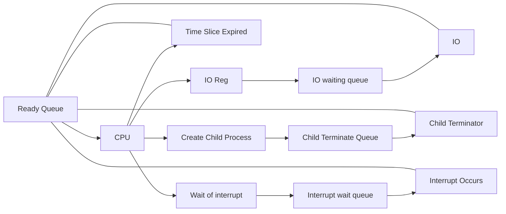
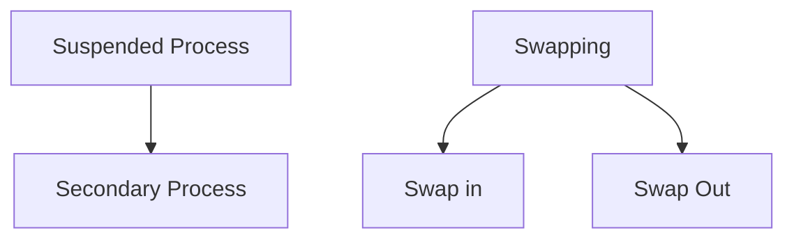
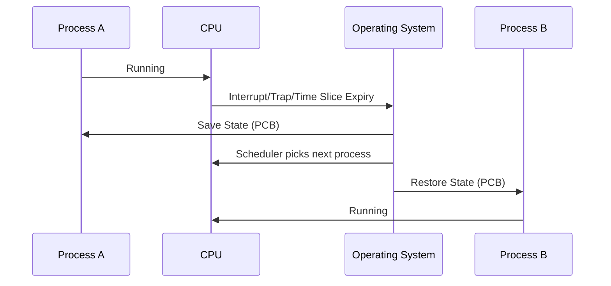
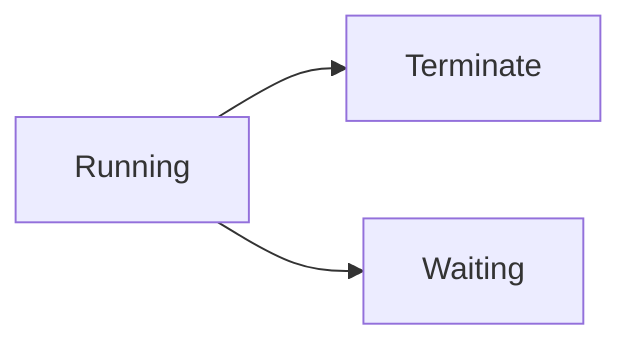

**Class**: [[Operating Systems]]

**Title:** Process

**Date:** 12-08-2025

**Time:** 09:06

**Tags:**

**Related:**
# Topic


---
# Keywords


--- 
# Notes

## Process Scheduling




### How Process is stored
- Processes are stored in a queue or a linked list

### Suspended Process



### Context Switching

- When a process is switched the Context is also switched
- State Save and State Recovery happens
	- State Save: Saves the current state of the interrupted process
	- State Recovery: 




**Explanation:**  
- **Process A** is currently running on the CPU.
- An **Interrupt**, **Trap**, or **Time Slice Expiry** triggers the OS.
- The **Operating System (OS)** saves the state of Process A (in its Process Control Block, PCB).
- The OS scheduler picks the next process to run.
- The OS restores the state of **Process B** from its PCB.
- **Process B** now runs on the CPU.

### Process Scheduling Criteria
Process scheduling criteria are the standards used by an operating system to determine how processes are selected for execution. These criteria help evaluate and compare different scheduling algorithms.

#### 1. **CPU Utilisation**
- **Definition:** Percentage of time the CPU is busy.
- **Goal:** Maximise CPU utilisation.

#### 2. **Throughput**
- **Definition:** Number of processes completed per unit time.
- **Goal:** Maximise throughput (higher is better).

#### 3. **Turnaround Time**
- **Definition:** Total time taken from submission to completion of a process.
- **Formula:**  
  `Turnaround Time = Completion Time - Arrival Time`
- **Goal:** Minimise turnaround time.

#### 4. **Waiting Time**
- **Definition:** Total time a process spends waiting in the ready queue.
- **Formula:**  
  `Waiting Time = Turnaround Time - Burst Time`
- **Goal:** Minimise waiting time.

#### 5. **Response Time**
- **Definition:** Time from submission of a request until the first response is produced.
- **Goal:** Minimise response time (important for interactive systems).

#### 6. **Fairness**
- **Definition:** All processes should get a fair share of CPU time.
- **Goal:** Prevent starvation; ensure equality among processes.

#### Summary Table

| Criteria            | Definition                                        | Goal             |
|---------------------|--------------------------------------------------|------------------|
| CPU Utilization     | % time CPU is busy                               | Maximize         |
| Throughput          | Processes completed per unit time                 | Maximize         |
| Turnaround Time     | Submission to completion time                     | Minimize         |
| Waiting Time        | Time in ready queue                               | Minimize         |
| Response Time       | Time to first response                            | Minimize         |
| Fairness            | Equal CPU share, prevent starvation               | Ensure Fairness  |

### Types of Scheduling
#### 1. Preemptive Scheduling

```mermaid
flowchart L
R["Running]

```

#### 2. Non Preemptive Scheduling

- Process holds more control than CPU
- Process takes over till the process is completed



---
# Work

- [ ] 


---
